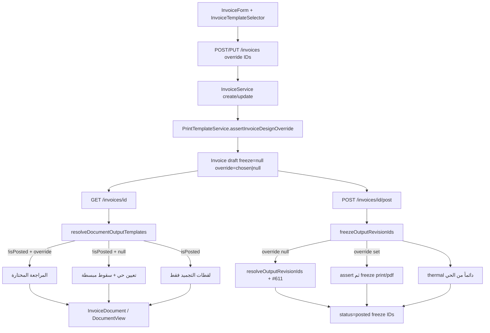

# تقرير تنفيذ اختيار تصميم الفاتورة عند الإنشاء — Per-document Override V1

**المشروع:** نبراس / أَوْج ERP  
**المستودع:** `safwan5001-source/Nebrax`  
**الفرع:** `cursor/invoice-create-template-selector-2bed`  
**الـ PR:** https://github.com/safwan5001-source/Nebrax/pull/633 (مسودة — لا دمج ولا نشر)  
**التاريخ:** 2026-09-03  
**القرار المعماري:** GO — Approved Architecture  
**الخطة:** [`AWJ_INVOICE_CREATE_TEMPLATE_SELECTOR_PLAN.md`](AWJ_INVOICE_CREATE_TEMPLATE_SELECTOR_PLAN.md)

لا Merge. لا Deploy.

---

## 1. Executive Summary

أُضيف اختيار تصميم A4 **لهذه الفاتورة فقط** من شاشة الإنشاء وتعديل المسودة، دون تغيير تعيين الشركة أو الفرع، ودون إعادة استخدام أعمدة التجميد كـoverride.

ثلاث طبقات منفصلة:

1. **Live Default Assignment** — `PrintTemplateService::resolve()` كما كان.
2. **Draft Document Override** — عمودان جديدان على `invoices` فقط.
3. **Posted Frozen Revision** — `print_template_revision_id` / `pdf_template_revision_id` / `thermal_template_revision_id` بلا تغيير دلالي.

واجهة V1 اختيار بصري واحد («تصميم الفاتورة») يُكتب في حقلي print وPDF. الحراري خارج النطاق ويبقى من الحل الحي عند الترحيل (#611). تجاوز باطل يُرفض برسالة عربية صريحة (422) بلا silent fallback. الـfallback الحي مسموح فقط عندما يكون الـoverride `null`.

هذه طبقة عرض فقط: لا قيد محاسبي جديد، لا تغيير ZATCA، لا aliases، لا تغيير `DEFAULT_TEMPLATE_ID`.

---

## 2. المعمارية بعد التنفيذ

لا تُكتب أعمدة التجميد قبل `post()`. المسودة لا تقرأها. المرحّل لا يقرأ أعمدة الـoverride للعرض.

---

## 3. الهجرة والتخزين

الملف: `database/migrations/2026_09_03_010000_add_print_template_override_to_invoices.php`

| العمود | النوع | FK | حذف |
|---|---|---|---|
| `invoices.print_template_override_revision_id` | uuid nullable | `print_template_revisions` | `nullOnDelete` |
| `invoices.pdf_template_override_revision_id` | uuid nullable | `print_template_revisions` | `nullOnDelete` |

- الجدول الوحيد: `invoices`. لا جداول جديدة، لا أعمدة على عروض/مشتريات/إشعارات.
- لا backfill. الفواتير القائمة تبقى `null` فتتبع التعيين الحي كما كان.
- أعمدة التجميد لم تُمسّ دلالتها ولا أسماؤها.
- إضافة FK على SQLite تعيد بناء الجدول فتفقد الفهرس الجزئي اليدوي؛ الهجرة تستعيد `invoices_tenant_id_number_branchless_unique` بعد `up` و`down` (نفس نمط `000064`).

علاقات النموذج: `printTemplateOverrideRevision()` و`pdfTemplateOverrideRevision()` منفصلتان عن علاقات التجميد الثلاث.

---

## 4. API

امتداد اختياري غير كاسر على `POST /invoices` و`PUT /invoices/{id}` فقط:

| الحقل | التحقق |
|---|---|
| `print_template_override_revision_id` | `nullable\|uuid` |
| `pdf_template_override_revision_id` | `nullable\|uuid` |

التحقق الحقيقي في الخادم عبر `PrintTemplateService::assertInvoiceDesignOverride()`:

- الوجود داخل المستأجر (`TenantScope` على `PrintTemplateRevision::whereKey`)
- الحالة `published`
- ليست تعريفاً حرارياً (`tax-invoice-thermal58` / `tax-invoice-thermal80`)
- متوافقة مع نوع كتالوج الفاتورة

المبسطة تقبل قوالب `tax_invoice` كما يسقط التعيين الحي عند غياب تعيين مبسطة.

سلوك التعديل:

- غياب المفتاح يُبقي القيمة القائمة.
- `null` يصفّر الاختيار (Reset).
- فاتورة مرحّلة ترفض التعديل أصلاً («لا يمكن تعديل فاتورة مرحّلة»).

`InvoiceResource` يعرّض الحقلين والعلاقات المحمَّلة. `show` / `store` / `update` / `post` تحمّل علاقات الـoverride منفصلة عن freeze.

النسخ (`InvoiceService::duplicate`) يمرّ بـ`create()` بلا مفاتيح override → المسودة الجديدة تتبع الافتراضي.

---

## 5. آلة الحالة

| الحالة | السلوك |
|---|---|
| override = null | المسودة تتبع التعيين الحي؛ تغيير Default يغيّر المسودة |
| override ≠ null | المسودة تتبع المراجعة المختارة؛ Default لا يُمس ولا يُتبع |
| Reset | الحقلان null |
| Post + null | `resolveOutputRevisionIds` الحالي بما فيه سقوط المبسطة (#611) |
| Post + override | تحقق صريح ثم freeze إلى أعمدة التجميد الحالية؛ thermal من الحي |
| Override باطل قبل الترحيل | رفض صريح؛ المعاملة تتراجع؛ لا قيد ولا مستند مرحّل |
| Duplicate | لا يُنسخ الـoverride |
| Posted | لا تعديل override؛ العرض التاريخي من freeze فقط |

---

## 6. Print / PDF / Thermal

| المخرج | المسودة | الترحيل | العرض بعد الترحيل |
|---|---|---|---|
| Print | override إن وُجد وإلا الحي | freeze من override أو الحي | freeze فقط |
| PDF | نفس اختيار V1 (نفس UUID) | freeze من override أو الحي | freeze فقط |
| Thermal | الحي فقط؛ الـoverride لا يُقرأ | الحي دائماً (#611) | freeze الحراري فقط |

العقد الحالي يسمح بنفس `published_revision_id` لـprint وpdf: `assertUsageCompatibleDefinition` يقيّد الحراري فقط. لا يُفترض أن UUID حراري صالح لـA4؛ الخادم يرفضه صراحة.

V1 يكتب الاختيار البصري الواحد في الحقلين معاً من `InvoiceForm`.

---

## 7. UX

- صف مضغوط في `InvoiceForm` بعد شريط «إنشاء مسودة فاتورة» وقبل بطاقة العميل. لا Card ضخمة. لا Sheet/Drawer (المشروع لا يملكهما).
- `Dialog` للمنتقى ومعاينة تجريبية: `getDocumentPreviewModel` + `DocumentView` + تلميح أنها ليست لقطة بيانات هذه الفاتورة.
- شارات: «افتراضي» / «مخصص لهذه الفاتورة».
- إعادة للافتراضي تصفّر الحقلين.
- القائمة: المراجعات المنشورة المتوافقة فقط عبر `publishedInvoiceDesignTemplates`.
- حفظ يُحجب إن كان الاختيار غير متوافق مع نوع ZATCA الحالي (`designCompatible`).
- Create + Draft Edit عبر النموذج نفسه؛ التعديل يحمّل المعرّف من API.

تفاصيل المسودة (`web/src/app/(app)/invoices/[id]/page.tsx`): `draftOverridePrint` / `draftOverridePdf` يُمرَّران إلى `resolveDocumentOutputTemplates` عندما `status === 'draft'`. المسار المرحّل يتجاهلهما ويقرأ freeze.

i18n: مفاتيح `invoiceForm.design_*` في `ar.json` / `en.json`.

---

## 8. الصلاحيات والعزل

| الفعل | الصلاحية |
|---|---|
| اختيار/حفظ override | `invoices.manage` (مسار الفاتورة القائم) |
| قراءة المكتبة والحل الحي | `invoices.view` |
| تعيين الشركة/الفرع | `company.manage` — **لم يُوسَّع** |

لا توسيع مركز التصاميم. لا مسار API جديد للقوالب.

عزل المستأجر: مراجعة مستأجر آخر تُحلّ `null` عبر `TenantScope` فتُرفض برسالة «مراجعة تصميم الفاتورة غير موجودة.» (422) — اختبار صريح `api_rejects_a_cross_tenant_override_revision`. الموظفون (`staff`) يُمنعون من كتابة الفاتورة (403). المحاسب يستطيع الكتابة.

---

## 9. القيود المحاسبية الناتجة

لا قيد محاسبي جديد. `LedgerService::post` لم يُمس. الترحيل يمر بالمسار القائم بعد إعادة اشتقاق الإجماليات من السطور، ثم يجمّد مراجعة الإخراج داخل المعاملة نفسها. إن كان الـoverride باطلاً تُرفض المعاملة كاملة فلا يُرحَّل قيد بلا مستند صالح للعرض (اختبار: الحالة تبقى `draft` و`JournalEntry::count() === 0`).

فاتورة نقدية 1000 ريال + ضريبة 15% = 115000 هللة (كما في اختبار التجاوز المرحّل):

| العملية | مدين | دائن | ملاحظة |
|---|---|---|---|
| ترحيل فاتورة نقدية (كما هو) | 1110 الصندوق 115000 | 4110 إيرادات المبيعات 100000 + 2120 ضريبة مخرجات 15000 | لم يتغيّر |
| ترحيل فاتورة آجلة (كما هو) | 1130 العملاء | 4110 + 2120 | لم يتغيّر |
| قيد تكلفة البضاعة (إن وُجد مخزون) | 5110 | 1140 | لم يُمس |
| تجاوز التصميم | — | — | عرض فقط؛ لا مبلغ |

كل المبالغ `bigint` هللات. Σ مدين = Σ دائن. المصدر `source_type = Invoice` + `source_id`.

---

## 10. ZATCA

لم تُمسّ خدمة ZATCA. عند الترحيل مع تجاوز صالح يبقى توليد QR/UUID/ICV/سلسلة الهاش كما هو (اختبار الترحيل يؤكد `zatca_qr` و`zatca_uuid`). `zatca_document_type` لقطة ضريبية مستقلة عن التصميم؛ يُستخدم فقط لاشتقاق نوع الكتالوج (`tax_invoice` / `simplified_tax_invoice`).

---

## 11. الملفات

### Backend

| ملف | الدور |
|---|---|
| `database/migrations/2026_09_03_010000_add_print_template_override_to_invoices.php` | العمودان + استعادة الفهرس الجزئي |
| `app/Models/Invoice.php` | fillable + علاقات override |
| `app/Http/Requests/StoreInvoiceRequest.php` | حقلان اختياريان nullable uuid |
| `app/Services/Accounting/InvoiceService.php` | `designOverrideAttributes` + `freezeOutputRevisionIds` |
| `app/Services/PrintTemplates/PrintTemplateService.php` | `assertInvoiceDesignOverride` |
| `app/Support/PrintTemplateContract.php` | حراري / توافق النوع / مبسطة←ضريبية |
| `app/Http/Resources/InvoiceResource.php` | تعريض الحقول والعلاقات |
| `app/Http/Controllers/Api/InvoiceController.php` | eager-load منفصل عن freeze |
| `tests/Feature/InvoiceTemplateOverrideTest.php` | 14 اختباراً (عزل، رفض باطل، حراري، نسخ، ترحيل) |
| `tests/Feature/InvoiceTest.php` | النسخ لا يحمل الـoverride |

### Frontend

| ملف | الدور |
|---|---|
| `web/src/modules/invoices/invoice-template-selector.ts` | تصفية المكتبة وتوافق النوع |
| `web/src/components/invoices/invoice-template-selector.tsx` | الصف المضغوط + Dialog + معاينة |
| `web/src/components/invoices/invoice-form.tsx` | الربط create/edit؛ كتابة الحقلين معاً |
| `web/src/modules/print-templates/services/document-output-template.ts` | `draftOverridePrint/Pdf` قبل الحي؛ المرحّل يتجاهلهما |
| `web/src/app/(app)/invoices/[id]/page.tsx` | تمرير override للمسودة فقط |
| `web/src/messages/ar.json` / `en.json` | `invoiceForm.design_*` |

لم تُمسّ: مركز التصاميم، `LedgerService`، `ZatcaService`، `DEFAULT_TEMPLATE_ID`، aliases، قوالب العروض/أوامر الشراء/الإشعارات.

---

## 12. الاختبارات والبناء

### Backend (محلي، `/tmp/nibras-app` بعد دمج النواة + php8.3-gd + poppler-utils)

- `php artisan test --filter=InvoiceTemplateOverrideTest`: **14 passed (66 assertions)**
- `php artisan test` كامل: **1 skipped, 2231 passed (15642 assertions)** — 131.65s
- التشغيل الأول بلا GD/poppler فشل في 8 اختبارات مرفقات/صور/PDF لا علاقة لها بهذا النطاق؛ بعد التثبيت صارت خضراء.
- GitHub CI على `c1b883a5` (كل كود PHP في هذا الـPR): **نجاح sqlite + pgsql**

حالات `InvoiceTemplateOverrideTest` المحروسة:

- إنشاء بلا تجاوز يترك العمودين والـfreeze `null`
- حفظ متوافق على print وpdf دون تغيير التعيينات
- Reset بـ`null` وإغفال المفتاح يُبقي الاختيار
- ترحيل بلا تجاوز يتبع التعيين الحي اللاحق
- ترحيل مع تجاوز يجمّده ويتجاهل تعييناً لاحقاً؛ الحراري من الحي؛ قيد متوازن 115000؛ ZATCA قائمة
- تجاوز غير منشور عند الترحيل يرفض ويتراجع
- حراري / نوع غير متوافق / UUID مفقود تُرفض عند الإنشاء
- النسخ لا يحمل الـoverride
- فاتورة مبسطة تقبل تجاوز `tax_invoice`
- API يعرّض الحقول
- مراجعة مستأجر آخر → 422
- staff → 403؛ accountant → 201

### Frontend (محلي)

- `npm run test` في `web/`: **215 files / 1351 tests passed** (23.71s)
- `npm run build`: نجح سابقاً على نفس الفرع (Next.js 15.5.19 + فحص الأنواع)

إصلاح اختبار: `pdfSharesPrintRoot` كان يفشل لأن كائنين `revision('override-print')` و`revision('override-pdf')` يختلفان في تذييل/ختم رغم نفس الـid. الالتزام `5fd2c874` يستخدم مراجعة واحدة للحقلين.

انظر §16 Final Browser QA — مسار المتصفح الحي اكتمل بعد ذلك.

---

## 13. SHAs والـPR

| العنصر | القيمة |
|---|---|
| القاعدة | `origin/main` عند `b7638d8e` |
| الميزة | `c1b883a5` feat(invoices): per-document print template override on draft invoices |
| إصلاح الاختبار | `5fd2c874` test(web): use shared override revision in document output template tests |
| تقرير التنفيذ + QA المتصفح | `8bc03a79` docs: Final Browser QA |
| PR | https://github.com/safwan5001-source/Nebrax/pull/633 — **مسودة** |

---

## 14. خارج النطاق (لم يُنفَّذ عمداً)

- كل أنواع المستندات الأخرى (عروض، أوامر شراء، إشعارات، سندات)
- Thermal redesign أو اختيار حراري للمستند
- aliases أو تغيير `DEFAULT_TEMPLATE_ID`
- إعادة كتابة تاريخية لفواتير مرحّلة
- توسيع مركز التصاميم أو `company.manage`
- Merge / Deploy
- محاسبة أو ZATCA جديدة

---

## 15. الأثر

| البند | النتيجة |
|---|---|
| API change | YES — اختياري/nullable غير كاسر |
| DB change | YES — عمودان على `invoices` |
| Migration | YES — معتمدة |
| Accounting | NO |
| ZATCA | NO |
| Tenant Isolation | YES — اختبار رفض صريح؛ بلا إضعاف العزل الحالي |

---

## 16. Final Browser QA

**التاريخ:** 2026-09-03  
**البيئة:** Laravel 11 على `127.0.0.1:8000` (SQLite بعد `migrate:fresh`) + Next.js 15 على `127.0.0.1:3000`  
**المستأجر:** `nibras-qa-633` / `owner@nibras-qa.test`  
**المستند:** `INV-2026-00001` (`a2a940a8-0c51-4618-b803-c29608009411`)  
**الطريقة:** Chromium headed على `DISPLAY=:1` عبر Playwright ضد التطبيق العامل (ليست Vitest). تسجيل شاشة + لقطات في `/opt/cursor/artifacts/`.  
**النتيجة الآلية:** 44 اجتيازاً، 0 فشلاً.

لم يُغيَّر كود المنتج بعد هذا الـQA: لا Bug مرتبط بـ#633 استوجب إصلاحاً.

### السيناريوهات المختبرة

1. فتح `/invoices/new` — العنوان «فاتورة جديدة».
2. صف «تصميم الفاتورة» بعد شريط «إنشاء مسودة فاتورة» وقبل بطاقة «العميل».
3. الاسم الحي «كلاسيكي افتراضي» + شارة «افتراضي». زر «إعادة للافتراضي» غائب.
4. «تغيير التصميم» يفتح Dialog «اختيار تصميم الفاتورة».
5. القائمة: كلاسيكي افتراضي، حديث V2، ERP V2 فقط. **حراري 80** و**عرض سعر رسمي** غير ظاهرين.
6. اختيار «حديث V2».
7. شارة «مخصص لهذه الفاتورة» + زر إعادة للافتراضي.
8. «معاينة»: تلميح «معاينة تجريبية… ليست لقطة نهائية»، جذر `#invoice-design-preview` بـ`dir=rtl`، بلا overflow أفقي (`scrollWidth === clientWidth`).
9. عميل «عميل الدمام» (VAT → `standard`) + سطر «خدمة استشارية» 1000×1 + «حفظ كمسودة».
10. إعادة فتح التعديل: الشارة المخصصة باقية؛ العمودان في API يحملان مراجعة حديث V2.
11. تغيير Default الشركة عبر API إلى ERP V2 ثم إعادة التحميل: المسودة بقيت «حديث V2» مخصصاً.
12. «إعادة للافتراضي» → الاسم يتبع الحي الجديد «ERP V2» → حفظ → العمودان `null`.
13. اختيار حديث V2 مرة أخرى وحفظ.
14. «ترحيل الفاتورة» من التفاصيل مع تأكيد.
15. `#print-root[data-doc-composition=modern_v2]`. Freeze: print/pdf = مراجعة حديث V2.
16. إعادة Default إلى الكلاسيكي بعد الترحيل: المعاينة التاريخية بقيت `modern_v2`.
17. قائمة الإجراءات: طباعة + تنزيل PDF؛ `#pdf-print-root` غائب لأن PDF يشارك جذر الطباعة (نفس المراجعة).
18. `#thermal-print-root` موجود بعرض ~80مم (302px)؛ `thermal_template_revision_id` بقي تعيين الحراري الحي لا الـoverride.

### Mobile RTL (390×844) — أولوية

| الفحص | النتيجة |
|---|---|
| موضع الـselector | بعد شريط المسودة وقبل العميل |
| overflow أفقي | 0px |
| `dir` | `rtl` على `html` |
| touch «تغيير التصميم» | ~98×44px |
| Dialog المنتقى | داخل العرض (x=16، عرض 343) |
| قائمة القوالب | A4 المتوافق فقط؛ بلا حراري/عرض سعر |
| badges | «افتراضي» ظاهرة |
| معاينة | داخل العرض؛ تلميح العينة ظاهر |
| sticky حفظ/ترحيل | «حفظ وترحيل» عند y≈788 داخل 844 |

### Desktop (1440×900)

Layout مضغوط صحيح، Dialog المعاينة `max` بلا قصّ، RTL للمستند، المسافات متسقة مع بطاقات النموذج. غلاف `DocumentScaler` قد يحمل `dir=ltr` بينما جذر المستند `rtl` — المحتوى المعروض عربي يمين؛ ليست عطلاً وظيفياً.

### النتائج حسب المحور

| المحور | النتيجة |
|---|---|
| Create | صف مضغوط + افتراضي كلاسيكي ثم اختيار حديث V2 |
| Draft persistence | العمودان محفوظان؛ التعديل يستعيد الشارة |
| تغيير Default والـoverride قائم | المسودة لا تتبع التعيين الجديد |
| Reset | يعود للحي (ERP V2 بعد تغيير التعيين) والعمودان null |
| Preview | عيّنة مع تلميح صريح؛ RTL؛ بلا clipping |
| Post/freeze | modern_v2 مجمّد؛ تجاهل Default اللاحق |
| Print/PDF | نفس مراجعة A4؛ PDF يشارك `#print-root` |
| Thermal regression | الجذر الحراري قائم؛ freeze الحراري = تعيين thermal80 لا V2 |

### Bugs

لا Bug مرتبط بـ#633. لا إصلاح كود. لا تغيير محاسبة/ZATCA/تعيينات المنتج/صلاحيات مركز التصاميم/دلالات التجميد.

### Tests / Build / CI بعد الـQA

لا تغيير منتج. الاختبارات والبناء السابقان ما زالا ينطبقان:

- Backend المحلي: 2231 ناجح، 1 متخطّى
- Frontend: 1351 ناجح
- GitHub PHP CI على `c1b883a5`: أخضر (sqlite+pgsql)
- GitHub Web CI على `5fd2c874`: أخضر

Final Head SHA: `8bc03a79a3d90abf72ee75193e03322bc9fdf156` (محتوى §16). أي التزام لاحق لتثبيت هذا السطر لا يغيّر كود المنتج. 

### القرار

**READY FOR MERGE**

المسار الكامل في المتصفح الحي طابق العقد المعتمد: تجاوز مسودة مستقل، رفض الحراري/عرض السعر في المنتقى، تجميد print/pdf عند الترحيل، الحراري من الحي، وعدم تأثر الشكل التاريخي بتغيير Default. الـPR يبقى مسودة؛ لا دمج ولا نشر من هذا العامل.
