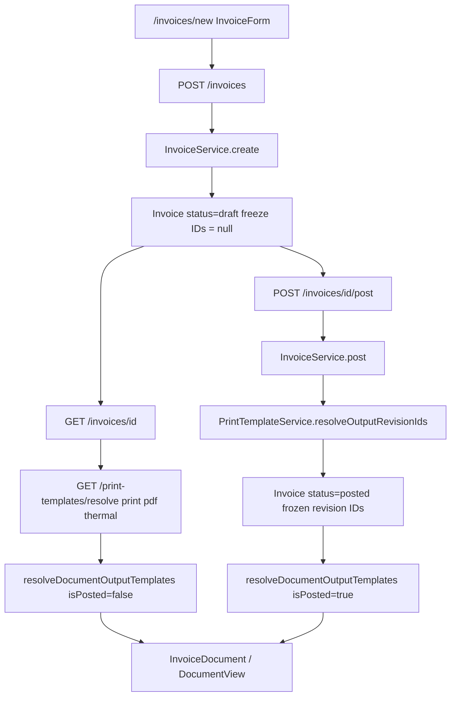

# AWJ ERP — Invoice Create Template Selector Plan

**القرار النهائي:** GO — Approved Architecture

امتداد DB/API المحدود معتمد ضمن هذا النطاق. التشخيص الأصلي (لا يوجد document-level override للمسودة) يبقى صحيحاً. مسار إعادة استخدام أعمدة التجميد في المسودة **مرفوض صراحة**.

المصدر المعماري المعتمد بعد STOP: قرار التنفيذ المؤرخ 3 أيلول 2026 (`AWJ_INVOICE_CREATE_TEMPLATE_SELECTOR_IMPLEMENTATION_DECISION`).

---

## 1. Executive Summary

نظام قوالب أَوْج قائم على ثلاث حقائق: مكتبة `PrintTemplate`، مراجعة منشورة ثابتة، وتعيين شركة/فرع حسب `document_type` و`usage`. الفاتورة المسودة اليوم **لا تخزّن قالباً**؛ عند الترحيل يجمّد `InvoiceService::post()` ثلاث مراجعات حية في أعمدة التجميد.

المطلوب: اختيار تصميم لهذه الفاتورة فقط من صفحة الإنشاء، دون تغيير Default Assignment.

التنفيذ المعتمد يضيف طبقة رابعة مستقلة للمسودة:

1. Live Default Assignment (كما هو).
2. Draft Document Override (عمودان جديدان).
3. Posted Frozen Revision (أعمدة التجميد الحالية بلا تغيير دلالي).

واجهة V1 اختيار بصري واحد («تصميم الفاتورة») يُطبَّق على Print وPDF لهذه الفاتورة. Thermal خارج النطاق. صلاحية الاختيار `invoices.manage`. Override باطل يُرفض برسالة صريحة؛ لا silent fallback إلا عندما يكون الـoverride فارغاً.

---

## 2. Current Architecture / Data Flow

1. [`web/src/app/(app)/invoices/new/page.tsx`](web/src/app/(app)/invoices/new/page.tsx) يعرض `InvoiceForm` بلا حالة قالب.
2. الحفظ: `POST /invoices` → [`InvoiceController::store`](app/Http/Controllers/Api/InvoiceController.php) → [`InvoiceService::create`](app/Services/Accounting/InvoiceService.php). لا حقول قالب في [`StoreInvoiceRequest`](app/Http/Requests/StoreInvoiceRequest.php).
3. التعديل: [`/invoices/[id]/edit`](web/src/app/(app)/invoices/[id]/edit/page.tsx) → نفس `InvoiceForm({ editId })`.
4. نوع الكتالوج: `zatca_document_type` (`standard` | `simplified` | null). الخادم: `PrintTemplateContract::invoiceDocumentType()`. الواجهة: `invoiceCatalogDocumentType()`. `simplified` → `simplified_tax_invoice`؛ غير ذلك بما فيه `null` → `tax_invoice`.
5. تفاصيل المسودة: [`web/src/app/(app)/invoices/[id]/page.tsx`](web/src/app/(app)/invoices/[id]/page.tsx) يستدعي `/print-templates/resolve` لكل usage، مع سقوط المبسطة إلى `tax_invoice` إن لم يوجد تعيين مبسطة.
6. العارض: [`resolveDocumentOutputTemplates`](web/src/modules/print-templates/services/document-output-template.ts). المسودة = تعيين حي. المرحّل = لقطات مجمّدة فقط.
7. التجميد: داخل معاملة `post()` عبر `resolveOutputRevisionIds($documentType, $invoice->branch_id)` ثم سقوط مبسطة إلى `tax_invoice`. POS والوقود يمرّان بنفس `post()`.
8. الهوية البصرية التاريخية: `definition.template_id` داخل JSON المراجعة. React renderer حي. لا alias من modern إلى modern-v2. `DEFAULT_TEMPLATE_ID` = `tax-invoice-classic`.

بعد التنفيذ يُدرج فرع override بين المسودة والحل الحي، دون المرور بأعمدة التجميد حتى لحظة `post()`.

---

## 3. Files Inspected

- إنشاء/تعديل: `web/src/app/(app)/invoices/new/page.tsx`, `web/src/app/(app)/invoices/[id]/edit/page.tsx`, `web/src/components/invoices/invoice-form.tsx` (+ tests)
- تفاصيل/عارض: `web/src/app/(app)/invoices/[id]/page.tsx`, `web/src/components/invoices/invoice-document.tsx`, `web/src/modules/documents/builder/from-invoice.ts`, `web/src/modules/documents/registry/templates.ts`
- حل الإخراج: `web/src/modules/print-templates/services/document-output-template.ts`, `live-template-definition.ts`, `frozen-output-template.ts` (+ tests)
- تعيينات: `print-template-assignment-resolution.ts`, `print-template-assignment-contract.ts`, `print-template-assignments.tsx`, `print-template-library.tsx`, `print-template-center.tsx`, `revision-visual-preview.ts`
- Backend: `app/Models/Invoice.php`, `InvoiceService.php`, `InvoiceController.php`, `StoreInvoiceRequest.php`, `InvoiceResource.php`, `PrintTemplateService.php`, `PrintTemplateController.php`, `PrintTemplateContract.php`, نماذج القوالب/التعيينات، migrations `000057` / `000059` / `000064` / `000065`
- صلاحيات: `routes/api.php`, `app/Support/Rbac.php`, `web/src/app/(app)/document-design/page.tsx`
- توثيق/اختبارات: `docs/PRINT_TEMPLATE_PLATFORM.md`, `tests/Feature/InvoiceTest.php`, `tests/Feature/PrintTemplateTest.php`
- UX: `web/src/components/ui/dialog.tsx`, `dropdown.tsx`, `badge.tsx`, `FormSection`

لا يوجد مكوّن `Sheet` أو `Drawer` في `web/src/components/ui`.

---

## 4. Current Template Assignment & Resolve Behavior

- التعيين: `(tenant_id, branch_id, document_type, usage)` → مراجعة منشورة.
- `branch_id = null` افتراضي شركة. وجود فرع = تجاوز. نقطة الحل الوحيدة: `PrintTemplateService::resolve()`. الواجهة تكرر الأولوية عبر `resolveAssignmentContext`.
- `usage`: `print` | `pdf` | `thermal` مستقلان.
- قراءة: `GET /print-templates`, `GET /print-templates/assignments`, `GET /print-templates/resolve` بـ`invoices.view`.
- كتابة/تعيين: `company.manage`.
- سجل React: `templateSupportsDocumentType` / `listTemplatesForDocumentType`. غياب `documentTypes` يبقي القالب متاحاً لكل الأنواع (قوالب الفاتورة التاريخية). `quotation-proposal` و`purchase-order-formal` مقيّدان. الحراري يُستبعد عبر `supportedPaper`.
- قائمة التفاصيل `PAGE_TEMPLATES` قائمة كتالوج عارض محلية، ليست قائمة قوالب المستأجر، وتُخفى عند وجود تعيين حي (`printLocked`).

---

## 5. Existing Document-level Override — No

**غير موجود** قبل هذا التنفيذ.

الموجود اليوم:

- تجميد بعد الترحيل في `print_template_revision_id` / `pdf_template_revision_id` / `thermal_template_revision_id`. Migration 000059 و`InvoiceResource`: null للمسوّدات.
- تعيين حي للمسودة يُحل في كل تحميل.
- قائمة محلية في التفاصيل لا تُحفظ ولا تصل للترحيل.

لا يوجد `template_override` على أي مستند. `InvoiceService::duplicate()` يعيد freeze IDs = null عبر `create()`.

---

## 6. Current Storage Model

على `invoices` اليوم (تبقى للتجميد فقط):

- `print_template_revision_id` — لقطة print عند الترحيل
- `pdf_template_revision_id` — لقطة PDF عند الترحيل
- `thermal_template_revision_id` — لقطة حرارية عند الترحيل

المراجعة تحمل `definition` JSON وفيه `template_id` النصي. لا عمود `template_id` على الفاتورة.

### التخزين المعتمد للـOverride (جديد)

لا تُستخدم أعمدة التجميد أعلاه كـdraft override.

يُضاف على `invoices` فقط:

- `print_template_override_revision_id` nullable UUID FK → `print_template_revisions`
- `pdf_template_override_revision_id` nullable UUID FK → `print_template_revisions`

علاقات `BelongsTo` جديدة على `Invoice` منفصلة عن علاقات التجميد. Tenant isolation عبر `TenantScope` على المراجعة. الفواتير الحالية تبقى `null` في الحقلين فتتبع السلوك القائم.

---

## 7. Draft Behavior

**اليوم:** المسودة تتبع التعيين الحي (فرع ثم شركة) حسب `zatca_document_type`، مع سقوط المبسطة إلى `tax_invoice`. تغيير Default يغيّر شكل المسودة.

**بعد التنفيذ:**

- override = null: كما اليوم حرفياً.
- override != null: العارض يستخدم مراجعتَي الـoverride. تغيير Default الخارجي لا يغيّر هذه المسودة.
- Reset: الحقلان null ثم العودة للحي.
- تغيير نوع ZATCA مع override غير متوافق: الواجهة تطلب إعادة اختيار أو إعادة للافتراضي؛ الخادم يرفض الحفظ/الترحيل إن أُرسل override باطل. لا تصفير صامت في الخادم.

---

## 8. Posted / Issued / Frozen Behavior

**اليوم:** `post()` يكتب الثلاث المراجعات من الحل الحي. بعدها العارض يتجاهل التعيين الحي. نشر أحدث أو تغيير التعيين لا يحرّك التاريخ. PDF بلا لقطة يسقط إلى print التاريخي لا إلى PDF حي.

**بعد التنفيذ (يحافظ على #611):**

1. لا override → `resolveOutputRevisionIds` الحالي بما فيه سقوط المبسطة.
2. يوجد override → تحقق ثم تجميد قيم الـoverride في أعمدة freeze لـprint وpdf.
3. Thermal دائماً من الحل الحي الحالي، لم يُمس.
4. بعد الترحيل: العرض من freeze فقط. لا Default لاحق ولا override لاحق يغيّر المستند التاريخي.
5. لا تُنسخ قيم الـoverride إلى freeze دون validate. لا يُعاد كتابة freeze لفاتورة مرحّلة.

---

## 9. Print vs PDF Semantics

التعيين والتجميد الحاليان مستقلان. المسودة: PDF بلا تعيين يسقط إلى print الحي. الحراري لا يسقط إلى print. `pdfSharesPrintRoot` عند تطابق التعريفين.

**V1 المعتمد:** اختيار بصري واحد يُطبَّق على Print وPDF لهذه الفاتورة. الحقلان يُحفظان منفصلين معمارياً.

العقد الحالي: نفس `published_revision_id` صالح لـprint وpdf لأن `assertUsageCompatibleDefinition` يقيّد `thermal` فقط. لذلك V1 يكتب **نفس UUID المراجعة المنشورة غير الحرارية** في الحقلين. لا يُفترض أن مراجعة حرارية صالحة لـA4.

الخيار B (منتقٍ لكل usage في الواجهة) مؤجّل. الخيار C (شكل بصري مع PDF مستقل) مرفوض في V1 لأنه يكسر ثقة المعاينة.

---

## 10. Proposed Default vs Override State Model

- **No override:** Draft follows live default. Post freezes live output (#611).
- **Explicit override:** Draft follows selected published revisions in the two override columns. Company/branch assignments unchanged.
- **Reset to default:** Both override columns null. Return to live resolution.
- **Posted:** Frozen output only. Override columns may remain as historical intent but rendering must not read them after post; source of truth is freeze columns.
- **Invalid explicit override:** Reject save and post with a stable error code + Arabic message. No silent fallback.
- **Duplicate:** New draft gets override = null.
- **POS / fuel `post()`:** No override on those drafts → live resolve unchanged.

---

## 11. Proposed UX

- **الموضع:** بعد شريط «إنشاء مسودة فاتورة» (`deliveryNotes.invoiceDraftAction`) وقبل `FormSection` العميل.
- **الشكل:** صف مضغوط `rounded border border-border bg-surface px-3 py-2.5` — ليس Card قسم كامل وليس `Select` طويلاً.
- **افتراضي:** الاسم + شارة `افتراضي` (Badge muted) + تغيير التصميم + معاينة.
- **مخصص:** الاسم + شارة `مخصص لهذه الفاتورة` + معاينة + إعادة للافتراضي.
- **Picker:** لا يوجد Sheet في المشروع. استخدم [`Dialog`](web/src/components/ui/dialog.tsx) (موبايل أعلى الشاشة بعرض كامل؛ ديسكتوب متمركز). لا اختراع Drawer.
- **المحتوى:** قوالب مستأجر منشورة متوافقة مع نوع الكتالوج الفعلي (`tax_invoice` أو `simplified_tax_invoice` حسب `zatca_document_type`)، مع سقوط عرض المبسطة إلى قوالب `tax_invoice` فقط بما يوازي حل التعيين الحالي إن لزم للشارة الافتراضية. استبعاد الحراري عبر التعريف/`supportedPaper`. إعادة استخدام `templateSupportsDocumentType` على `definition.template_id` و`document_types` للمراجعة. لا سجل React أعمى كمصدر حقيقة.
- **Thumbnail:** إن بقي صغيراً: `DocumentScaler` + `DocumentView` + `getDocumentPreviewModel` كما في مكتبة التصاميم، بارتفاع منخفض (~`h-28`). وإلا قائمة اسم + شارة فقط.
- **Loading / empty / error:** هيكل في الصف؛ فشل جلب التعيين لا يمنع الحفظ المحاسبي إن override = null؛ قائمة فارغة توضح الافتراضي الآمن.
- **RTL / لمس:** أزرار `size=sm` / `h-8`. لا gradients ولا ظلال ثقيلة.

Draft Edit عبر نفس `InvoiceForm` ضمن نفس PR.

Posted: لا منتقي override.

---

## 12. Preview Strategy

لا renderer ثانٍ ولا Preview Engine جديد.

- Thumbnail وزر معاينة V1: بيانات تجريبية آمنة (`getDocumentPreviewModel`) + تعريف المراجعة المنشورة. تُوضَّح في الواجهة أنها معاينة للتصميم لا لقطة نهائية لبيانات هذه الفاتورة.
- لا mapper لحالة النموذج غير المحفوظ في V1.
- بعد حفظ المسودة: صفحة التفاصيل تعرض المستند الحقيقي مع الـoverride.

---

## 13. Permissions

- إدارة القوالب/التعيينات: `company.manage`؛ واجهة المركز `owner`/`admin`.
- إنشاء/تعديل فاتورة: `invoices.manage`.
- قراءة المكتبة والحل: `invoices.view`.

**المعتمد:** من يملك `invoices.manage` يختار قالباً منشوراً قائماً. لا صلاحية جديدة. لا توسيع مركز التصاميم. المحاسب يملك `invoices.manage`. staff الافتراضي لا يصل لصفحة الإنشاء.

---

## 14. Proposed Technical Design

1. **Migration** على `invoices` فقط: العمودان الجديدان + FK إلى `print_template_revisions` + فهارس. رقم الملف يُختار عند التنفيذ بعد أعلى ترحيل قائم (حالياً يوجد حتى `000133` وملفات `2026_*`). لا جداول جديدة. لا مساس بأعمدة freeze.

2. **Model:** `Invoice` fillable + علاقات `printTemplateOverrideRevision` و`pdfTemplateOverrideRevision`.

3. **Request:** في `StoreInvoiceRequest` حقلان اختياريان `nullable|uuid`. الغياب يُبقي القيمة عند التعديل (`array_key_exists` كباقي حقول المسودة). إرسال `null` يصفّر الـoverride.

4. **Validation service:** مراجعة موجودة عبر TenantScope، `status = published`، `document_types` يتضمن نوع كتالوج الفاتورة، التعريف غير حراري. مستأجر آخر → 404/422 دون تسريب. لا `withoutGlobalScopes`.

5. **create/update:** حفظ العمودين بعد التحقق. لا `assign()` / `unassign()`.

6. **post():** داخل المعاملة القائمة بعد بناء القيد وZATCA كما هي:
   - إن كان أي من عمودي الـoverride غير null: أعد التحقق؛ عند الفشل أوقف الترحيل برسالة صريحة (لا ترحّل بنصف قيد). ثم freeze print/pdf من الـoverride. thermal من الحي.
   - إن كانا null: `resolveOutputRevisionIds` الحالي حرفياً بما فيه سقوط المبسطة.
   - لا تكتب على أعمدة الـoverride بعد الترحيل.

7. **Resource:** إرجاع العمودين + المراجعات عند التحميل، منفصلاً عن freeze.

8. **Frontend resolve:** توسيع `resolveDocumentOutputTemplates` بمدخل override للمسودة يسبق live عندما `!isPosted`. عند `isPosted` تبقى freeze فقط. لا تمرير override إلى مسار posted.

9. **Selector:** يحمّل `GET /print-templates` و`GET /print-templates/resolve?document_type=&usage=print|pdf` مع `branch_id` من الفرع النشط (`X-Branch-Id`). الشارة الافتراضية من حل print (وpdf إن طابق).

10. **save_post:** يرسل الـoverride في create/update قبل `POST .../post` حتى لا يضيع الاختيار.

---

## 15. Expected Files to Change

### Frontend

- `web/src/components/invoices/invoice-form.tsx`
- `web/src/components/invoices/invoice-form.test.tsx`
- `web/src/components/invoices/invoice-template-selector.tsx` (جديد)
- `web/src/components/invoices/invoice-template-selector.test.tsx` (جديد)
- `web/src/modules/invoices/invoice-template-selector.ts` (جديد، تصفية نقية)
- `web/src/modules/invoices/invoice-template-selector.test.ts` (جديد)
- `web/src/modules/print-templates/services/document-output-template.ts`
- `web/src/modules/print-templates/services/document-output-template.test.ts`
- `web/src/app/(app)/invoices/[id]/page.tsx`

### Backend

- `database/migrations/*_add_print_template_override_to_invoices.php` (جديد)
- `app/Models/Invoice.php`
- `app/Http/Requests/StoreInvoiceRequest.php`
- `app/Http/Resources/InvoiceResource.php`
- `app/Http/Controllers/Api/InvoiceController.php` (تحميل العلاقات في show إن لزم)
- `app/Services/Accounting/InvoiceService.php`
- `app/Services/PrintTemplates/PrintTemplateService.php` فقط إن استُخرجت دالة تحقق مشتركة دون تغيير `resolve()`

### Tests

- `tests/Feature/InvoiceTest.php`
- اختبار عزل مستأجر صريح على مسار الـoverride (داخل `InvoiceTest` أو ملف feature مركز)

### i18n

- `web/src/messages/ar.json`
- `web/src/messages/en.json`

لا ملفات Template Center/Studio، لا Ledger، لا ZatcaService.

---

## 16. API Impact

**YES** — امتداد اختياري غير كاسر.

- `POST /invoices` و`PUT /invoices/{id}`: `print_template_override_revision_id` و`pdf_template_override_revision_id` اختياريان nullable.
- العملاء القدامى لا يرسلونهما → override يبقى null → السلوك الحالي.
- `GET /invoices/{id}` يعيد الحقلين عند التوفر.
- لا مسار assignments جديد.
- التحقق server-side إلزامي.

---

## 17. DB / Migration / Schema Impact

- **API change:** YES (optional)
- **DB change:** YES
- **Migration:** YES — معتمدة. جدول `invoices` فقط. عمودان nullable FK. لا backfill. لا تغيير تعيينات. لا rewrite لـfreeze.
- **Accounting impact:** NO
- **ZATCA impact:** NO
- **Tenant Isolation impact:** YES يجب اختباره وتعزيزه — بلا إضعاف

---

## 18. Accounting & ZATCA Safety

القالب عرض فقط. ممنوع المساس بـ: subtotal، discount، tax، VAT، total، rounding، posting، ledger، journal lines، payment، inventory، ZATCA XML/QR/UUID/ICV/hashes/reporting/clearance/submission. `zatca_document_type` يبقى لقطة ضريبية مستقلة عن التصميم.

`post()` يُدخل التحقق/التجميد بعد بناء القيد وZATCA كما اليوم، أو يفشل المعاملة كاملة إن كان الـoverride باطلاً فلا يُرحَّل قيد بلا مستند صالح للعرض المتفق عليه.

---

## 19. Tenant Isolation

القوالب والتعيينات `CompanyWide` + `TenantScope`. الحل يحترم الفرع صراحة في `resolve()`. كتابة الـoverride:

- تبحث المراجعة داخل نطاق المستأجر الحالي فقط.
- ترفض UUID مستأجر آخر.
- تتحقق من نوع المستند وصلاحية النشر.
- لا endpoint جديد يتجاوز `SetTenant`.

اختبار صريح: مستأجر B يضع مراجعة مستأجر A على فاتورة B → يُرفض.

POS/الوقود بلا الحقل يبقيان على الحي.

---

## 20. Backward Compatibility

- الفواتير الحالية: override = null → نفس النظام.
- التعيينات: بلا migration وبلا reassignment.
- freeze التاريخي: بلا rewrite.
- Legacy وVisual V2: هويات مستقلة بلا alias.
- Print/PDF المستقلان للمستندات بلا override يبقيان. مع override V1 يُوحَّد A4 لهذه الفاتورة فقط عبر الحقلين.
- `DEFAULT_TEMPLATE_ID`: بلا تغيير.
- النسخ: بلا override منسوخ.
- قائمة التفاصيل المحلية الحالية تُترك أو تُحجَب للمسودة ذات الـoverride حتى لا تتعارض؛ لا تُحوَّل إلى نظام قوالب موازٍ.

---

## 21. Risks / Edge Cases

- معاينة تجريبية ≠ بيانات الفاتورة الحقيقية (موثّق في UX).
- Default يتغيّر أثناء فتح النموذج: مع override لا يتأثر؛ بلا override يُعاد الجلب عند تغيّر الفرع إن أمكن.
- `simplified_tax_invoice` مقابل `tax_invoice`.
- مراجعة تُستبدل/تُحذف بعد الاختيار: رفض صريح عند الحفظ والترحيل.
- أولوية فرع لشارة «افتراضي».
- كتابة UUID واحد في الحقلين صحيحة لـA4؛ مراجعة حرارية مرفوضة.
- سباق save_post: يجب إرسال الـoverride في create قبل post.
- لا alias تاريخي.
- لا silent fallback لـoverride باطل.
- قائمة التفاصيل `printLocked` ليست override.

---

## 22. Testing Plan

Backend مركز:

- إنشاء بلا override
- Default assignment لا يتغيّر بعد الاختيار
- اختيار متوافق يُحفظ في print وpdf override
- Reset إلى null
- مسودة بلا override تتبع الحي بعد تغيير التعيين
- مسودة بـoverride تتجاهل تغيير التعيين اللاحق
- الترحيل يجمّد الـoverride في أعمدة freeze
- العرض المرحّل يقرأ freeze لا override/live
- override باطل يُرفض عند الحفظ والترحيل
- نوع مستند غير متوافق يُرفض
- cross-tenant يُرفض
- صلاحيات: بلا `invoices.manage` لا كتابة
- انحدار تعيين print/pdf المستقل للمستندات بلا override
- Thermal دون تغيير
- الفواتير القائمة null override
- إجماليات القيد وZATCA QR/UUID دون تغيير في اختبار ترحيل قائم

Frontend مركز:

- شارة افتراضي / مخصص
- اختيار / إعادة تعيين
- loading / error
- RTL عربي وLTR إنجليزي
- Dialog على عرض ضيق
- Draft edit إن وُجد
- معاينة MVP تجريبية
- لا تظهر قوالب غير متوافقة

ثم: اختبارات أوسع ذات صلة، `php artisan test` كامل إن أمكن أو مجموعة invoices/print-templates كحد أدنى مع تبرير، `npm run build` في `web/`.

---

## 23. Implementation Steps

1. كتابة هذا الملف (تم في مرحلة تحديث الخطة).
2. Branch من أحدث `origin/main`: `cursor/invoice-create-template-selector-2bed`.
3. Migration + model + resource.
4. Validation + create/update + post freeze path.
5. Frontend selector + InvoiceForm create/edit draft.
6. تفاصيل المسودة.
7. i18n.
8. اختبارات مركزة ثم الأوسع ثم build.
9. Commit + push + PR (draft حتى يصبح جاهزاً للمراجعة) + تقرير تنفيذ Markdown.
10. توقف. لا Merge. لا Deploy.

---

## 24. Scope

**Invoice Create Template Selector / Per-document Override V1** فقط.

يشمل Draft Edit عبر نفس `InvoiceForm` إن بقي ضمن نفس البنية.

---

## 25. Out of Scope

Quotation، Purchase Order، Credit/Debit Note، Proforma، Sales Order، Purchase Invoice، Vouchers، Statement، Delivery Note، Packing List، Thermal redesign، Template Center/Builder، إعادة تصميم النموذج، aliases، `DEFAULT_TEMPLATE_ID`، migration تعيينات، rewrite تاريخي، mapper معاينة غير محفوظة، محاسبة، ZATCA، Merge، Deploy.

---

## 26. Recommendation

نفّذ المسار المعتمد: عمودا override جديدان، Option A بصرياً مع حقلين مخزّنين، Dialog لا Sheet مخترع، معاينة تجريبية، `invoices.manage`، رفض صريح للباطل، freeze عبر الأعمدة الحالية عند الترحيل فقط. أدرج Edit Draft. أوقف بعد PR والاختبارات والتقرير.

---

## 27. STOP / GO Decision

## GO — Approved Architecture

كان STOP صحيحاً قبل اعتماد التخزين. الآن معتمد:

- Migration صغيرة على `invoices` لعمودي override
- API اختياري غير كاسر
- `post()` يجمّد الـoverride إلى أعمدة freeze الحالية دون تغيير دلالتها
- لا استخدام لأعمدة freeze كـdraft override
- لا تغيير محاسبي أو ZATCA
- عزل المستأجر باختبار صريح

التنفيذ مسموح ضمن هذا الملف فقط. لا Merge. لا Deploy.
