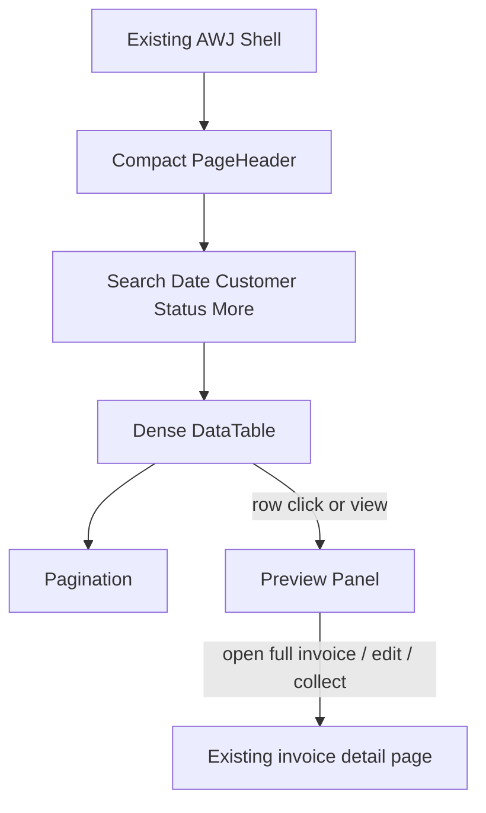

# أَوْج ERP — مساحة فواتير المبيعات V2

## تقرير Phase A: فحص + خطة تنفيذ

**المشروع:** أَوْج AWJ ERP  
**النطاق:** مساحة قائمة فواتير المبيعات فقط  
**المرحلة:** A — Inspect + Plan  
**الحالة:** بانتظار موافقة صفوان قبل أي تنفيذ  
**الدمج:** ممنوع  
**النشر:** ممنوع  
**تاريخ الفحص:** 2026-09-03

---

## Summary

فُحصت مساحة فواتير المبيعات الحالية، والشريط الجانبي الفعلي في أَوْج، وبنية الجدول، وعقود الـ API، وصفحة التفاصيل، والهيكل، وRTL/LTR، والثيم.

الخلاصة: هذا الـ Pilot يحسّن **محتوى** شاشة `/invoices` فقط. الشريط الجانبي الحالي هو مصدر الحقيقة، وترتيب RTL فيه صحيح، و**لن يُعدَّل**.

لا يوجد مصدر موثوق لمؤشرات «إجمالي الفترة / المدفوع / المستحق / المتأخر» على مستوى القائمة، لذلك لن يُلفَّق شريط KPI. لوحة التفاصيل المقترحة معاينة مضغوطة تعيد استخدام `GET /invoices/:id`، وليست نسخة ثانية من صفحة الفاتورة.

لا تنفيذ حتى الموافقة الصريحة على هذه الخطة.

---

## 1. قرار الشريط الجانبي — Source of Truth

الملفات المفحوصة:

- [`web/src/components/layout/sidebar.tsx`](web/src/components/layout/sidebar.tsx)
- [`web/src/app/(app)/layout.tsx`](web/src/app/(app)/layout.tsx)
- [`web/src/components/layout/nav-visibility.ts`](web/src/components/layout/nav-visibility.ts)
- [`web/src/components/layout/topbar.tsx`](web/src/components/layout/topbar.tsx)
- [`web/src/messages/ar.json`](web/src/messages/ar.json) مفاتيح `nav.*`

اللقطات التي قدّمها صفوان («هذا الحالي») تطابق التنفيذ الحالي حرفياً. أي نموذج أولي بصري **لا** يُستبدل به هذا الشريط.

### 1.1 الهيكل الفعلي الذي يجب الحفاظ عليه

- ترويسة: شعار الشركة + الاسم من `/me` + زر طيّ سطح المكتب / إغلاق الجوال.
- رابط ثابت أعلى القائمة: **لوحة التحكم**.
- أربع عناوين خافتة غير قابلة للنقر ولا للطي:

| العنوان الخافت | المجموعات تحته |
|---|---|
| إدارة الإيرادات | المبيعات، نقطة البيع، العملاء |
| العمليات | المخزون، المشتريات، اللوجستيات، محطات الوقود |
| المالية والموارد | الحسابات، المالية، الموارد البشرية، التشغيل والعمليات |
| الإدارة | الفروع، الإعدادات |

- نمط Accordion حصري: مجموعة واحدة مفتوحة كحد أقصى، مع طيّ يدوي.
- على الشاشات الواسعة: طيّ إلى أيقونات (`lg:w-16`) مع قائمة flyout.
- على الجوال (`max-width: 1023px`): Drawer من الطرف المنطقي (`start`) مع خلفية معتمة وEscape. **لا شريط تنقل سفلي.**
- الظهور محكوم بـ `GET /applications/nav-state` + RBAC عبر `isNavEntryVisible`. فشل الجلب لا يخفي الشريط.

مدخل فواتير المبيعات في الشريط يبقى كما هو:

- المجموعة: المبيعات
- العنصر: **إدارة الفواتير** → `/invoices`
- إنشاء فاتورة عنصر منفصل: `/invoices/new`

### 1.2 ترتيب RTL لصف المجموعة القابل للطي

الكود يستخدم `flex` عادياً (ليس `row-reverse`) مع خصائص منطقية (`start` / `end` / `ms-auto`).

الترتيب البصري المقصود والمتحقق:

**أيقونة → التسمية → سهم التوسيع/الطي في الطرف البعيد**

- في العربية (`dir="rtl"`): الأيقونة يميناً، السهم يساراً.
- دوران السهم: `ltr:-rotate-90 rtl:rotate-90`.
- مؤشر النشاط: خط `3px` على `start` + خلفية `primary-soft`.

**لا يوجد عيب RTL يستدعي تصحيحاً.**

### 1.3 قرار التنفيذ

**لا يُلمس** `sidebar.tsx` ولا الهيكل ولا ألوان الشريط ولا التسلسل ولا الصلاحيات ولا الاستحقاق التجاري ولا سلوك الطي/الدرج.

---

## 2. مساحة فواتير المبيعات الحالية

الشاشة: [`web/src/app/(app)/invoices/page.tsx`](web/src/app/(app)/invoices/page.tsx)

التسلسل الحالي:

1. `PageHeader` (العنوان + مبدّل الفرع + إنشاء)
2. `ListToolbar` (بحث + فرز + فلاتر سريعة + شرائح نشطة)
3. `DataTable`
4. `Pagination`
5. `AdvancedFilterDialog`
6. `Dialog` لحذف المسودة

### 2.1 القدرات التي يجب أن تبقى

| القدرة | الواقع الحالي |
|---|---|
| عنوان الشاشة | `invoices.title` = **الفواتير** |
| عنصر الشريط | **إدارة الفواتير** |
| إنشاء | `/invoices/new` — النص: **إنشاء فاتورة** |
| نطاق الفرع | `BranchViewToggle` → `branch=all` عند «كل الفروع» |
| بحث | رقم الفاتورة / اسم العميل / مرجع الدفع — debounce 300ms ومزامنة URL |
| فلاتر API | `status`, `payment_status`, `partner_id`, `date_from/to`, `due_from/to`, `total_gte/lte`, `remaining_gte/lte` |
| فرز خادمي | `number`, `invoice_date`, `due_date`, `total`, `remaining` |
| أعمدة الجدول | رقم، عميل، تاريخ، إجمالي، متبقي، حالة، سداد، إجراءات |
| إجراءات الصف | عرض كامل / تعديل مسودة فقط / حذف مسودة مع تأكيد |
| قفل المرحّل | تعديل وحذف معطّلان + `posted_locked` |
| عرض الجوال | `mobileRecord` موجود أصلاً (رقم، عميل، إجمالي، متبقي، حالتان، تاريخ، إجراءات) |
| ظهور الأعمدة | `useDataTableColumnVisibility('invoices')` — الرقم والإجراءات محميان |
| حالات الواجهة | تحميل / خطأ مع إعادة المحاولة / فراغ — لكن الفراغ و«لا نتائج» غير مميزين |

### 2.2 حالات المجال الفعلية — لا تُخترع أسماء

حالة المستند:

- مسودة `draft`
- مرحّلة `posted`
- ملغاة `cancelled`

حالة السداد:

- غير مدفوعة `unpaid`
- جزئية `partial`
- مدفوعة `paid`

**لا توجد حالة API اسمها «متأخرة».** أي تلميح تأخير في الواجهة يجب أن يبقى اشتقاقاً عرضياً من حقول موجودة، لا حالة مجال جديدة ولا فلتر مخترع.

### 2.3 صفحة التفاصيل الحالية

[`web/src/app/(app)/invoices/[id]/page.tsx`](web/src/app/(app)/invoices/[id]/page.tsx) صفحة مستقلة كاملة، وليست جزءاً من القائمة:

- ترحيل المسودة مع تأكيد
- تكرار
- تسجيل قبض إن كانت مرحّلة وغير مدفوعة بالكامل
- إنشاء مرتجع مبيعات للمرحّلة
- ملاحظات ومرفقات
- طباعة / PDF / مشاركة / Excel / حراري
- ZATCA QR
- علاقات: مدفوعات، مرفقات، حركة مخزون، قيود محاسبية
- سجل مراجعات

**لن تُعاد كتابة هذه الصفحة، ولن يُبنَى نموذج أعمال ثانٍ للفاتورة.**

---

## 3. التكامل مع الـ API

المسار: `GET /invoices` عبر [`InvoiceController::index`](app/Http/Controllers/Api/InvoiceController.php) و[`InvoiceResource`](app/Http/Resources/InvoiceResource.php).

الصلاحية: `invoices.view` للقائمة والعرض، `invoices.manage` للإنشاء/التعديل/الحذف/الترحيل.

الحقول المعادة للقائمة **موجودة أصلاً** حتى إن لم تعرضها الشاشة اليوم:

- `number`, `partner_id`, `invoice_date`, `due_date`
- `status`, `payment_status`
- `subtotal`, `tax_amount`, `total`, `paid_amount`, `remaining`

لا حاجة لتغيير عقد الـ API لإظهار تاريخ الاستحقاق أو الضريبة أو المدفوع في الجدول.

`remaining` مشتق خادماً عبر `Invoice::remaining()` ويُعرض بالريال من المورد. الواجهة تنسّق عبر `formatRiyal` فقط ولا تعيد الحساب المحاسبي.

---

## 4. الفجوات وBlockers

### 4.1 شريط الملخص المالي — فجوة بيانات

المهمة تقترح أمثلة: إجمالي الفترة، المدفوع، المستحق، المتأخر.

الواقع:

- لا يوجد `GET /invoices/summary` ولا أي عقد تجميعي للقائمة.
- `meta` ترقيم فقط: `current_page`, `last_page`, `per_page`, `total`.
- جمع أرقام الصفحة الحالية مضلل محاسبياً.
- لوحة التحكم تجمع من قائمة مجتلبة في الواجهة؛ هذا **ممنوع** في هذا الـ Pilot.

**القرار المقترح:** لا شريط KPI في هذه المرحلة. إن رُغبت مؤشرات موثوقة لاحقاً فهذا طلب Backend منفصل بعد الـ Pilot.

### 4.2 تصدير القائمة

`DataTable` يملك تصدير CSV، لكنه مخفي على شاشة الفواتير لأن `showToolbar={false}`.

**القرار المقترح:** إعادة إظهار التصدير محلياً على هذه الشاشة (مثلاً عبر `trailing` في شريط الأدوات)، من دون اختراع تصدير Excel/PDF للقائمة.

### 4.3 طباعة القائمة وإجراءات جماعية

غير موجودة. تحديد الصفوف مدعوم في `DataTable` لكن شاشة الفواتير لا تستخدمه ولا يوجد bulk delete/print.

**القرار المقترح:** لا اختراع طباعة قائمة ولا حذف جماعي.

### 4.4 لوحة التفاصيل بجانب الجدول

غير موجودة. النقر ينتقل إلى `/invoices/[id]`.

لا يوجد مكوّن `Sheet` عام في المشروع. الحوار الحالي [`web/src/components/ui/dialog.tsx`](web/src/components/ui/dialog.tsx) نافذة مركزية.

**القرار المقترح:** مكوّن معاينة محلي لمسار الفواتير فقط، وليس إضافة نظام Sheet على مستوى AWJ.

---

## 5. المكوّنات المعاد استخدامها

### 5.1 تُستخدم كما هي

- هيكل التطبيق: `Sidebar` + `Topbar` + `DemoBanner` + `BranchScope`
- [`PageHeader`](web/src/components/nebrax/page-header.tsx)
- [`ListToolbar`](web/src/components/nebrax/list-toolbar.tsx) أو أجزاؤه: `SearchBar`, `QuickFilters`, `ActiveFilterChips`, `AdvancedFilterDialog`
- [`DataTable`](web/src/components/data-table.tsx) + `ColumnLayoutMenu` + `ServerSortControl`
- [`MobileRecordItem`](web/src/components/nebrax/mobile-record.tsx)
- [`Pagination`](web/src/components/nebrax/pagination.tsx)
- `Badge`, `Button`, `Dialog`, `BranchViewToggle`
- `formatRiyal` + صنف `.num` (IBM Plex Mono للأرقام والأكواد فقط)
- رموز الثيم من [`web/src/app/globals.css`](web/src/app/globals.css)
- اتجاه الصفحة من [`web/src/app/layout.tsx`](web/src/app/layout.tsx): `ar → rtl` وإلا `ltr`

### 5.2 قد تحتاج تغييراً طفيفاً

- [`web/src/components/ui/table.tsx`](web/src/components/ui/table.tsx) / `DataTable`: كثافة صف 40–48px عبر class أو prop اختياري لهذه الشاشة فقط، مع بقاء الافتراضي كما هو لبقية الجداول.
- `ListToolbar`: **لا يُعاد تصميمه عالمياً.** أي ترتيب خاص بالفواتير يُركَّب في الصفحة أو في مكوّن محلي.

### 5.3 مكوّنات جديدة محلية — لا تعميم على النظام

تحت `web/src/components/invoices/` فقط:

- شريط فلاتر/أدوات خاص بالفواتير إن لزم ترتيب Search → Date → Customer → Status
- `InvoicePreviewPanel`: معاينة مضغوطة من `GET /invoices/:id` + روابط إلى الصفحات الموجودة

---

## 6. الملفات المتوقع تغييرها بعد الموافقة

| ملف | السبب |
|---|---|
| [`web/src/app/(app)/invoices/page.tsx`](web/src/app/(app)/invoices/page.tsx) | تجميع مساحة العمل: كثافة، أعمدة، فلاتر، تصدير، معاينة، حالات |
| `web/src/components/invoices/invoice-preview-panel.tsx` | جديد — لوحة معاينة |
| ربما `web/src/components/invoices/invoices-workspace-toolbar.tsx` | ترتيب الفلاتر محلياً دون تعديل `ListToolbar` العام |
| [`web/src/messages/ar.json`](web/src/messages/ar.json) و[`en.json`](web/src/messages/en.json) | نصوص المساحة فقط |
| اختبارات vitest بجانب المكوّنات الجديدة | فراغ مقابل لا نتائج، معاينة، كثافة/سجل جوال |
| `data-table.tsx` / `table.tsx` | فقط إن تعذّرت الكثافة محلياً، وبسلوك افتراضي مطابق للحالي |

### لن تُغيَّر

- `sidebar.tsx`, `layout.tsx`, `nav-visibility.ts`, `topbar.tsx`
- خدمات المحاسبة، الضريبة، ZATCA، الترحيل، الترقيم
- العزل، الصلاحيات، الاستحقاق التجاري
- الهجرات وعقود API

---

## 7. التخطيط المقترح — المحتوى فقط

الهيكل الخارجي لأَوْج يبقى كما هو. التغيير داخل `main` لشاشة `/invoices`:

1. الهيكل الحالي (Sidebar + Topbar)
2. رأس صفحة مضغوط
3. بحث وفلاتر (بدون بطاقات KPI ملفّقة)
4. أدوات الجدول (تصدير CSV، ظهور الأعمدة، الفرز)
5. DataTable كثيف — البطل
6. ترقيم
7. لوحة معاينة / overlay

### 7.1 سطح مكتب واسع

- الشريط الحالي بعرضه الكامل.
- جدول كامل.
- لوحة معاينة من الطرف المنطقي (`inset-inline-end`) إن اتسع العرض دون قتل الأعمدة الأساسية.
- ضغط الفلاتر الثانوية قبل المساس برقم / عميل / إجمالي / متبقي.

### 7.2 لابتوب / سطح مكتب قياسي

- نفس الهيكل.
- إن ضاق العرض: المعاينة تغطي كـ overlay بدل اقتسام يضر الجدول.
- سلوك الشريط يبقى طيّ/توسيع الحالي.

### 7.3 جهاز لوحي

- الشريط = Drawer الحالي تحت `lg`.
- الفلاتر الثانوية (تاريخ الاستحقاق، مبلغ، متبقي) تبقى داخل «المزيد».
- المعاينة overlay.

### 7.4 جوال

- **لا تقليص لجدول سطح المكتب.** الإبقاء على `mobileRecord`.
- الحد الأدنى الظاهر: رقم، عميل، حالة + سداد، إجمالي/متبقي، تاريخ.
- المعاينة بعرض كامل.
- القائمة من زر الـ Topbar الحالي. **لا bottom navigation.**

---

## 8. قرارات الواجهة داخل المساحة

### 8.1 الرأس

- يبقى مضغوطاً عبر `PageHeader`.
- مبدّل الفرع يبقى سياقاً، لا بطاقة.
- الإجراء الأساسي واضح بصرياً؛ الإجراءات الثانوية لا تنافسه.
- بلا بطاقات حول الرأس.

**نصوص للموافقة:**

| العنصر | الحالي | نص المهمة | التوصية |
|---|---|---|---|
| H1 | الفواتير | فواتير المبيعات | اعتماد **فواتير المبيعات** على هذه الشاشة فقط |
| زر الإنشاء | إنشاء فاتورة | + فاتورة جديدة | اعتماد **فاتورة جديدة** على هذه الشاشة فقط |
| عنصر الشريط | إدارة الفواتير | — | **يبقى كما هو** |

المسار يبقى `/invoices/new`.

### 8.2 البحث والفلاتر

نفس عقد API الحالي. الترتيب البصري المستهدف:

**بحث → تاريخ الفاتورة → عميل → حالة المستند → حالة السداد → المزيد**

- الفلاتر النشطة تبقى شرائح قابلة للإزالة.
- تاريخ الاستحقاق والمبالغ تبقى في الفلترة المتقدمة.
- `QuickFilters` الحالي لا يعرض `dateRange` حتى لو `quick: true`. لذلك عناصر التاريخ تُضاف محلياً لشاشة الفواتير، لا بتعميم على كل القوائم.

### 8.3 DataTable

هذا أعلى أولوية الـ Pilot.

**أساسي:** رقم (`dir="ltr"` + `.num`)، عميل (truncate + `title` كما هو)، حالة المستند، الإجمالي، المتبقي.

**ثانوي:** تاريخ الفاتورة، تاريخ الاستحقاق (الحقل موجود في الـ API وغير معروض اليوم).

**داعم عبر إظهار الأعمدة:** قبل الضريبة، الضريبة، المدفوع.

قواعد المبالغ:

- `formatRiyal` فقط.
- أرقام جدول بخط Mono ومحاذاة نهاية منطقية.
- إجمالي الفاتورة العادي **ليس أخضر**.
- الألوان الدلالية للحالات والنقص/التأخير فقط، مع نص وليس لوناً وحده.

تلميح «متأخر» — عرض صفّي فقط إذا تحقق:

- `status === 'posted'`
- `Number(remaining) > 0`
- `due_date` أقدم من اليوم

هذا تلميح `warning` + نص. ليس حالة جديدة وليس فلتر API.

كثافة الصف المستهدفة: تقريباً 40–48px.

### 8.4 لوحة المعاينة

معاينة مضغوطة، ليست صفحة التفاصيل.

1. الحالة + رقم الفاتورة
2. العميل
3. تاريخ الفاتورة وتاريخ الاستحقاق
4. ملخص مالي من مورد التفاصيل: قبل الضريبة / الضريبة / الإجمالي / المدفوع / المتبقي
5. أسطر مختصرة إن وُجدت
6. إجراءات آمنة:
   - فتح الصفحة الكاملة
   - تعديل المسودة فقط
   - تسجيل قبض إن `posted` وغير مدفوعة بالكامل

الترحيل، الحذف، المرتجع، الطباعة، ZATCA، القيود، المرفقات الكاملة تبقى في `/invoices/[id]` مع حراساتها الحالية. الرابط المباشر لهذه الصفحة يبقى صالحاً.

على الجوال: overlay بعرض كامل. على الشاشات الأضيق من اقتسام مريح: overlay أيضاً.

### 8.5 حالات الواجهة

- تحميل يحافظ على هيكل المساحة/الجدول قدر الإمكان.
- خطأ مع إعادة المحاولة كما هو.
- تمييز **لا فواتير في الحساب** عن **لا نتائج تطابق الفلاتر/البحث**.
- صفوف محددة: غير مطلوب في هذا الـ Pilot لعدم وجود إجراءات جماعية حقيقية.
- فلاتر نشطة ظاهرة عبر الشرائح الحالية.
- اسم عميل طويل: truncate + title (موجود).
- مبلغ كبير: `.num` + `formatRiyal` بدون كسر الصف.

### 8.6 اللغة البصرية

أداة محاسبية يومية: حدود، تباعد، طباعة، تراتب. نصف القطر الحالي ~8px.

ممنوع: تدرج، زجاج، توهج، ظل ثقيل، بطاقات KPI ضخمة، صناديق أيقونات ملونة، حركة مفرطة، فراغ مفرط، جمالية لوحات AI.

---

## 9. RTL / LTR والثيم

بعد التنفيذ يُتحقق في العربي والإنجليزي من:

- صفوف الشريط (بلا تغيير متوقع)
- أسهم الطي
- الجدول والمحاذاة
- الترقيم
- البحث والفلاتر والقوائم والتواريخ
- لوحة المعاينة
- أيقونات الإجراءات والأسهم
- أرقام المستندات والأسماء المختلطة والبريد/الهاتف إن ظهرت في المعاينة

فاتح وداكن عبر الرموز الحالية فقط:

`--background`, `--surface`, `--text`, `--muted`, `--border`, `--primary`, `--primary-soft`, `--positive`, `--negative`, `--warning`

التحقق يشمل: خلفية، سطوح، جدول، حدود، نص خافت، hover، شارات، تركيز، قوائم، حوارات، لوحة المعاينة، تحميل، فراغ، خطأ.

---

## 10. الاختبارات بعد الموافقة — Phase B/C

لا اختبارات Backend. لا إضعاف اختبارات قائمة.

أولاً:

- `cd web && npm test -- src/components/data-table.test.tsx src/components/nebrax/list-toolbar.test.tsx src/components/nebrax/mobile-record.test.tsx`
- اختبارات المكوّنات الجديدة لمساحة الفواتير

ثم:

- `cd web && npm test`
- `cd web && npm run build`
- `cd web && npm run lint` إن بقي التغيير داخل `web/`

التحقق البصري الإلزامي قبل الإغلاق:

- سطح مكتب واسع / لابتوب / لوحي أفقي / لوحي عمودي / جوال كبير / جوال صغير
- عربي RTL / إنجليزي LTR
- فاتح / داكن
- تكبير 100% / 125% / 150%
- شريط موسّع/مطوي، درج الجوال مفتوح، معاينة مفتوحة/مغلقة
- اسم عربي طويل، محتوى مختلط، مبلغ كبير، فلاتر نشطة، تحميل، فراغ، خطأ، لا نتائج

لقطات حقيقية من التشغيل، لا نماذج مولَّدة، حسب قائمة المهمة الأصلية.

---

## 11. المخاطر

| خطر | المعالجة |
|---|---|
| لوحة المعاينة تنتفخ فتصبح نسخة ثانية من التفاصيل | تبقى معاينة + روابط؛ الإجراءات المحاسبية الحساسة في الصفحة الكاملة |
| تغيير كثافة `DataTable` العام يكسر قوائم أخرى | الكثافة محلية أو عبر prop اختياري بسلوك افتراضي مطابق |
| تلميح «متأخر» يُفهم كحالة مجال | نص توضيحي، بلا فلتر جديد وبلا إعادة تسمية `payment_status` |
| تغيير نص العنوان/الزر | المسارات تبقى؛ عنصر الشريط لا يتغير |
| غياب مؤشرات الفترة | موثّق صراحة؛ لا أرقام ملفّقة |

---

## 12. خارج النطاق في هذا الـ Pilot

- أي تعديل على الشريط أو الهيكل أو الصلاحيات أو الاستحقاق
- محاسبة، ضريبة، ZATCA، ترحيل، ترقيم، عزل، هجرات
- مؤشرات مالية ملفّقة أو إعادة حساب في الواجهة
- شريط تنقل سفلي
- تعميم النمط على قوائم أخرى في أَوْج
- إعادة كتابة صفحة تفاصيل الفاتورة
- طباعة قائمة أو حذف جماعي

---

## 13. Definition of Done — بعد التنفيذ لاحقاً

يُعتبر التنفيذ مكتملاً فقط عندما:

- مساحة فواتير المبيعات تحسّنت مادياً من حيث الكثافة والوضوح والتراتب
- الشريط والتنقل كما هما
- تسلسل الوحدات والصلاحيات والاستحقاق كما هي
- قدرات الفواتير الحالية محفوظة
- لا تغيير محاسبي / ضريبي / ZATCA / عزل / مخطط قاعدة بيانات
- لا تغيير غير ضروري في عقد API
- السلوك المتجاوب وRTL/LTR والفاتح/الداكن متحققة
- الحالات المطلوبة معالجة
- اختبارات الواجهة والبناء المطلوبة ناجحة

---

## 14. نقاط تحتاج موافقة صفوان قبل Phase B

1. **الشريط كما هو بلا أي لمس.**
2. **إسقاط شريط KPI** لعدم وجود مصدر تجميعي موثوق.
3. **لوحة معاينة مضغوطة** بدل استنساخ صفحة التفاصيل، مع بقاء `/invoices/[id]` للعمليات الكاملة.
4. **نص العنوان «فواتير المبيعات» وزر «فاتورة جديدة»** على هذه الشاشة فقط، مع بقاء عنصر الشريط «إدارة الفواتير».

---

## Next Step

بعد الموافقة الصريحة على البنود الأربعة أعلاه: بدء Phase B — تنفيذ الواجهة فقط على فرع مستقل، بلا دمج وبلا نشر.

**هذه نهاية Phase A. لا تنفيذ حتى الموافقة.**
