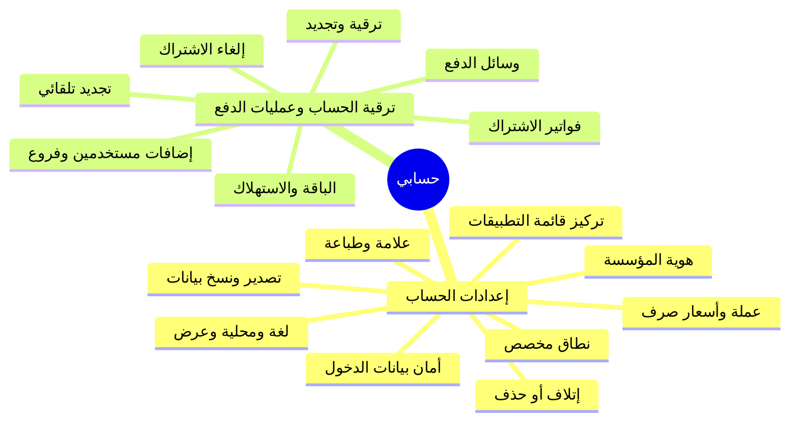
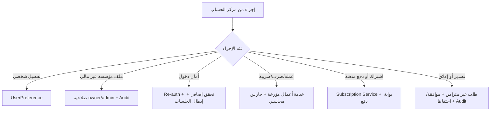

# مرجع «حسابي» في دفترة لبناء Nebrax ERP

> **الغرض:** هذا المستند يلخّص البنية العامة والتدفقات التي توثقها صفحات «حسابي» الرسمية في دفترة، ثم يحوّلها إلى **مرجع قرارات** لبناء قسم حساب/إعدادات متماسك في Nebrax. وهو **تحليل معماري مستقل**؛ لا ينسخ شاشات أو نصوصاً أو تدفقات دفترة حرفياً، ولا يغيّر السلوك المحاسبي القائم في Nebrax.
>
> **حدّ المصدر:** يصف هذا المرجع ما هو منشور في التوثيق العام الذي روجع في 20 أغسطس 2026. لا يكشف التوثيق العام كل القواعد الداخلية أو الصلاحيات أو التكاملات؛ لذلك تُصنّف النتائج أدناه إلى «سلوك موثّق»، و«استنتاج معماري»، و«قرار مقترح لـ Nebrax».

## 1. الملخص التنفيذي

تنظم دفترة «حسابي» تحت غلاف واحد له مساران واضحان: **إعدادات الحساب** و**ترقية الحساب وعمليات الدفع**. المسار الأول يغطي هوية الشركة، تفضيلات العرض والمحلية، الأمان، النطاق، النسخ الاحتياطي، إدارة ظهور التطبيقات، والإجراءات الخطرة. والمسار الثاني يغطي خطة الاشتراك، الاستهلاك، إضافات المستخدمين والفروع، الفواتير التجارية، وسائل الدفع، الترقية والتجديد والإلغاء. [1] [2] [3]

القيمة التي ينبغي أن يأخذها Nebrax ليست تجميع كل ما سبق في صفحة واحدة، بل اعتماد **حدود واضحة بين أربعة أنواع من البيانات**: بيانات المؤسسة، تفضيلات المستخدم، دورة الاشتراك التجاري، وإدارة البيانات الخطرة. في Nebrax توجد بالفعل نواة جيدة لهذه الحدود: المستأجر `Tenant` يحمل العملة والبلد والمنطقة الزمنية والخطة وحدودها؛ و`Settings` هو المصدر الموحد لتفضيلات المؤسسة؛ و`PlanGate` يفرض حدود الفواتير والمستخدمين. لكن واجهة الحساب الحالية تعرض ملخص الاشتراك وملف الشركة فقط، ولا توجد بعد دورة اشتراك تجارية أو طبقة تفضيلات شخصية أو بوابة تصدير/استرجاع مدققة.

| النتيجة | القرار المقترح لـ Nebrax |
|---|---|
| «حسابي» مساحة متعددة الوظائف وليست بطاقة إعدادات | بناء **مركز حساب** متعدد التبويبات، مع روابط مستقلة في مجموعة «الإعدادات» لا صفحة متضخمة واحدة. |
| تفضيلات العرض ليست بيانات محاسبية | فصلها في `UserPreference`، وليس داخل `Tenant.settings` ولا ضمن ملف الشركة. |
| العملة وسعر الصرف يؤثران في التقارير والمعاملات | تثبيت عملة الأساس بعد أول مستند مرحّل، وبناء سجل أسعار صرف **مؤرخ وغير قابل للتعديل بأثر رجعي**. |
| الاشتراك التجاري مستقل عن ERP العميل | إنشاء نماذج فوترة اشتراك منفصلة عن `LedgerService` ودفتر أستاذ المستأجر. |
| النسخ والحذف إجراءات سيادية خطرة | تصدير مقيّد الصلاحية مع سجل تدقيق؛ ورفض «تصفير البيانات» الذاتي للمنشأة المحاسبية المنتجة. |

## 2. خريطة المصدر: كيف يبني دفترة قسم «حسابي»

تظهر الصفحة الرئيسة لقسم «حسابي» فرعين فقط، ثم تتفرع كل فئة إلى أدلة مستخدم ودروس وفيديوهات وأسئلة شائعة. [1] وهذا التقسيم مهم لأنه يفصل **الإدارة التشغيلية للحساب** عن **العلاقة التجارية مع منصة SaaS**.



### 2.1 فهرس موضوعات «إعدادات الحساب»

تسجل فئة إعدادات الحساب **18 دليلاً أساسياً**، إلى جانب دروس وفيديوهات وأسئلة شائعة مرتبطة بالاستعادة والتصدير وظهور التطبيقات. [2] ويمكن اختزال الفهرس إلى الطبقات التالية دون فقد المعنى الوظيفي.

| الطبقة | الموضوعات المنشورة | المعنى المعماري |
|---|---|---|
| هوية المؤسسة | الاسم التجاري، الهاتف، الشعار، النطاق | ملكية مؤسسة أو منصة، مع حقول متفاوتة الحساسية. |
| المحلية والعرض | اللغة، المنطقة الزمنية، التاريخ والوقت، تنسيق السالب، الطباعة، الوضع الداكن والثيم | تفضيلات يجب أن تكون قابلة للفصل بين المؤسسة والمستخدم. |
| المال المرجعي | عملة الأساس وأسعار الصرف | بيانات تؤثر في المستندات والتقارير؛ ليست مجرد تفضيل بصري. |
| الأمان | البريد الإلكتروني، كلمة المرور، الاستعادة | تدفقات إعادة تحقق وإبطال جلسات. |
| البيانات | تنزيل بيانات CSV/XML، التعامل مع CSV، تصفير الحساب، حذف الحساب | دورة حياة بيانات تحتاج بوابات وسجلاً تدقيقياً. |
| تجربة مساحة العمل | حصر القائمة في برنامج وتطبيقاته أو العودة إلى كل التطبيقات | حالة واجهة سياقية، لا صلاحية ولا بوابة خطة. |
| العلامة عبر الفروع | شعار عام ثم تجاوز داخل قالب فرع | هرم توريث: مؤسسة ← قالب/فرع ← مستند. |

### 2.2 فهرس «ترقية الحساب وعمليات الدفع»

تربط الفئة التجارية خطة الاشتراك بحدود الموارد، وفواتيرها التجارية، ومسار الدفع والتجديد. توثق الأدلة إضافة مستخدم أو موظف أو فرع من صفحة معلومات الحساب مع عرض العدد الحالي ثم اختيار العدد الإجمالي وسداد الزيادة. [3] [11] كما توثق فواتير ومدفوعات الاشتراك القابلة للعرض والتنزيل بصيغة PDF. [12]

| المجال | السلوك المنشور في التوثيق | القيمة المرجعية لـ Nebrax |
|---|---|---|
| خطة واستهلاك | عرض الخطة وموعد التجديد والاستهلاك من معلومات الحساب. [4] | لوحة مختصرة تقود إلى تفاصيل لا إلى شاشة حساب مختلطة. |
| إضافات كمية | إضافة مستخدمين/موظفين/فروع كتعديل مدفوع على العدد. [11] | فصل **الاستحقاق** عن العدد التشغيلي الفعلي؛ لا تُرفع حدود الخطة مباشرة من واجهة العميل دون حالة دفع مؤكدة. |
| الدفع | وسائل دفع تختلف حسب السوق؛ ويذكر الدليل ضريبة مضافة على بعض التحويلات. [13] | طبقة بوابة دفع وسياسات سوق مستقلة عن دفتر أستاذ المستأجر. |
| الفواتير التجارية | سجل تاريخ/مبلغ، عرض الدفعة، وتنزيل فاتورة PDF. [12] | سجل غير قابل للتعديل لفواتير Nebrax، منفصل عن فواتير العميل لعملائه. |
| الترقية | اختيار خطة وسداد فرق، مع إشارة إلى رصيد نسبي عن الفترة المتبقية. [14] | نموذج تسعير وفوترة مضبوط بالهللات وبفترة/بداية/نهاية واضحة. |
| التجديد | اختيار خطة ثم إتمام الدفع، مع خيار تجديد تلقائي لوسائل دفع مؤهلة. [15] [16] | خزّن **تفويض التجديد** وحالة وسيلة الدفع، لا بيانات البطاقة. |
| الإلغاء | يمر في المرجع عبر المبيعات أو مدير الحساب. [17] | لبيانات ERP المحاسبية: طلب إلغاء/إغلاق مدقق بدلاً من زر حذف ذاتي. |

## 3. السلوكيات الموثقة ذات الأثر التصميمي

### 3.1 «إعدادات الحساب» تجمع هوية المؤسسة وتفضيلات النظام

يوثق الدليل المركزي إمكانية ضبط الاسم التجاري والهاتف والمنطقة الزمنية وصيغة التاريخ والوقت وتنسيق العملات السالبة واللغة ونوع النشاط وطريقة الطباعة. كما يعرض رقم الحساب ورقم الدعم والخطة وموعد التجديد والاستهلاك. [4]

هذا يبرهن أن المستخدم يتوقع العثور على **هوية المؤسسة + حالة الحساب** في نقطة واحدة. لكنه لا يعني أن Nebrax ينبغي أن يخزنها كلها في كائن واحد. فالتغيير في اسم الشركة مختلف عن تغيير اللغة المفضلة لمستخدم، وكلاهما مختلف عن تغيير صيغة عرض سالب في تقرير.

### 3.2 المحلية واللغة تؤثران في الواجهة، لا في هوية القيود

يوثق دفترة دعماً للعربية والإنجليزية، ويذكر أن تغيير لغة النظام يغيّر أسماء الحسابات الافتراضية في دليل الحسابات. [8] كما يطبق صيغة التاريخ والوقت المختارة في جميع شاشات الحساب، ويوفر تقويم أم القرى للحسابات السعودية. [9]

> **قرار Nebrax المقترح:** لا تنسخ أثر «اللغة تعيد تسمية الحسابات الافتراضية». يجب أن تبقى **أكواد الحسابات** ثابتة، وأن تحفظ أسماء عربية وإنجليزية للحسابات النظامية، بينما تكون لغة الواجهة `locale` تفضيلاً للمستخدم. هذا يمنع تغييراً جماعياً غير ضروري في بيانات ذات معنى محاسبي أو في مراجع تقارير سابقة.

### 3.3 العملة وسعر الصرف مجال محاسبي وليس حقل ملف شخصي

تفصل الوثائق بين عملة الحساب والقدرة على إصدار مستندات بعملات مختلفة، وتمنع تغيير البلد أو عملة الحساب بعد الإنشاء. [4] كما توثق سجل سعر تحويل محدد بالعملة المصدر والهدف و**تاريخ بدء الاستخدام** وقيمة التحويل. [5]

بالنسبة لـ Nebrax، تعديل حقل العملة النصي في ملف الشركة بعد بدء العمليات غير كافٍ وغير آمن. يجب أن تكون عملة الأساس قابلة للاختيار فقط قبل أول ترحيل مالي، وأن يكون سعر الصرف **صفاً مؤرخاً** يستعمل عند إنشاء المستند/القيد ويُحفظ أثره على المستند، بدلاً من قراءة سعر حي قابل للتعديل لاحقاً.

### 3.4 البريد وكلمة المرور عمليات أمان عالية الحساسية

توثق الأدلة إدخال كلمة المرور الحالية قبل تغيير البريد، وقد يتطلب التغيير إعادة تسجيل الدخول. [6] وتطبق الفكرة نفسها على كلمة المرور الجديدة وتأكيدها. [7] وهذا أساس جيد، لكن الحد الأدنى الحديث في Nebrax يجب أن يضيف إبطال جميع جلسات/رموز الوصول القديمة وإشعار البريد السابق والجديد وسجل تدقيق، مع دعم عامل ثانٍ في مرحلة لاحقة.

### 3.5 التصدير مفيد؛ التصفير الذاتي غير مقبول لمنشأة محاسبية منتجة

يسمح الدليل بتنزيل مجموعات بيانات محددة بصيغتي CSV أو XML للباقات المدفوعة. [18] لكنه يوثق أيضاً «تصفير بيانات الحساب» بعد إعادة إدخال البريد وكلمة المرور وتحذير بأن المعاملات والقوالب والتصميمات الخاصة ستُحذف. [19]

> **قرار Nebrax المقترح:** نأخذ نموذج **تصدير مجموعات بيانات منتقاة**، ولا نأخذ نموذج تصفير المعاملات ذاتي الخدمة. القيود المرحّلة في Nebrax غير قابلة للتعديل أو الحذف؛ لذا لا يمكن أن يكون مسحها إجراء إعدادات. البديل هو بيئة تجريبية منفصلة، أو طلب حذف حساب يخضع لفترة احتفاظ قانونية وموافقة مالك المنصة وإثبات عدم وجود التزامات حفظ.

### 3.6 العلامة البصرية تحتاج هرم توريث لا تكرار ملفات

يوثق الدليل أن الشعار العام يظهر افتراضياً في فواتير جميع الفروع، بينما يمكن تجاوز الشعار في قالب مستند فرع محدد؛ ولا يغير هذا التجاوز شعار قشرة النظام العامة. [10]

هذا ينسجم مع معمارية Nebrax متعددة الفروع: **شعار المؤسسة** في `Settings::company.logo`، ثم صورة/خاصية اختيارية في تعريف قالب الطباعة مع نطاق فرع. لا يجب نسخ الشعار في كل فرع أو كل فاتورة؛ بل تجميد المرجع/النسخة في مخرجات الطباعة المنشورة حيث يلزم الأثر الرجعي.

### 3.7 تركيز قائمة التطبيقات حالة تجربة مستخدم، لا أمن أو صلاحية

يوثق دليل «عرض قائمة برامج النظام وتطبيقاتها» مرشحاً يختار برنامجاً واحداً مثل المبيعات لإظهار تطبيقاته، ثم يسمح بالعودة إلى كل التطبيقات. [20] هذه فكرة مفيدة في ERP واسع النطاق، لكن اختيار المجموعة لا يمنح صلاحية ولا يخفي البيانات لأسباب أمنية.

**التطبيق المقترح في Nebrax:** `workspace_focus` تفضيل مستخدم محفوظ محلياً أو في `UserPreference`، يفلتر الشريط الجانبي إلى مجموعة مثل المبيعات أو المالية، مع خيار «كل الوحدات». يظل `EnsurePermission` و`PlanGate` مصدرَي الحقيقة للوصول والإتاحة.

## 4. مقارنة واقعية: دفترة مقابل Nebrax الآن

في Nebrax الحالي، `Tenant` يخزن اسم المؤسسة ورقمها الضريبي والسجل التجاري والعملة والبلد والمنطقة الزمنية والخطة وحدود الخطة والاشتراك والتفضيلات. كما يعرض `GET /me` ملف الشركة الأساسي مع الشعار، ويعيد `GET /subscription` الخطة والحالة وتواريخ التجربة/الاشتراك وحدود الفواتير والمستخدمين واستهلاكهما. [N1] [N2] [N3]

| القدرة | المرجع المنشور في دفترة | Nebrax اليوم | القرار |
|---|---|---|---|
| ملف الشركة | هوية وتفضيلات متعددة في مركز الحساب | اسم، ضريبة، سجل، عملة، بلد، وشعار | **وسّع على مراحل**؛ لا تحول الصفحة إلى تجميعة عشوائية. |
| الاشتراك | خطة، تجديد، استهلاك، فواتير، دفع وترقية | ملخص قراءة فقط للحالة والحدود واستهلاك فواتير/مستخدمين | **ابنِ دورة تجارية مستقلة** قبل إتاحة أزرار شراء أو تجديد. |
| حدود الباقة | زيادة مستخدمين وفروع عبر السداد | `PlanGate` يفرض حد الفواتير والمستخدمين | **أضف entitlement للفرع** أولاً، ثم طلب تغيير كمي مدفوع. |
| العملة | أساس ثابت وسعر صرف مؤرخ | `currency` حقل قابل للتعديل في نموذج الشركة | **اقفل بعد أول ترحيل** وأنشئ دفتر أسعار صرف مؤرخ. |
| اللغة/التاريخ/السالب | موجودة على مستوى الحساب | لا واجهة تفضيلات مخصصة حالياً | **افصل مستخدم/مؤسسة** ولا تغير أسماء حسابات دفتر الأستاذ من لغة الواجهة. |
| الأمن | تغيير البريد/كلمة المرور بإعادة تحقق | لا مسار حساب مخصص ظاهر في شاشة الإعدادات | **ابنِ مسارات مستقلة** مع re-auth وإبطال الرموز وسجل تدقيق. |
| تصدير/نسخ | تصدير مجموعات بيانات للباقات المدفوعة | لا بوابة تصدير حساب عامة | **ابنِ ExportJob** مقيّداً وموثقاً؛ لا تعد باستعادة ذاتية كاملة. |
| تصفير/حذف | مدعوم مع تحذير في المرجع | لا يظهر كقدرة قائمة | **لا تنفذ تصفيراً ذاتياً**؛ استخدم دورة إغلاق وحذف منضبطة. |
| تخصيص العلامة للفروع | الشعار العام مع تجاوز قالب الفرع | شعار مؤسسة، وبنية قوالب طباعة قائمة | **استثمر في توريث القالب**؛ لا تضف شعار فرع عشوائياً إلى `Tenant`. |
| تركيز التنقل | تصفية قائمة التطبيقات حسب برنامج | شريط جانبي مجمّع ومحدد | **إضافة لاحقة UX**، مستقلة عن RBAC والخطة. |

## 5. البنية المستهدفة المقترحة لـ Nebrax

### 5.1 شجرة معلومات المستخدم

لا ينبغي أن تكون كل العناصر في `/settings`. المقترح هو مركز حساب باختصارات واضحة، مع إبقاء إعدادات الوحدات المحاسبية في مجموعاتها الحالية.

```text
الإعدادات
├── إعدادات الحساب                    (/settings/account)
│   ├── ملف المؤسسة
│   ├── الشعار والهوية العامة
│   ├── اللغة والمنطقة الزمنية
│   ├── إعدادات عرض التقارير والطباعة
│   └── معلومات الدعم ومعرّف المؤسسة
├── الأمان والوصول                    (/settings/security)
│   ├── البريد الإلكتروني
│   ├── كلمة المرور
│   ├── الجلسات والأجهزة
│   └── المصادقة متعددة العوامل [لاحق]
├── الاشتراك والفوترة                 (/settings/subscription)
│   ├── الخطة والاستخدام والاستحقاقات
│   ├── الترقية أو التجديد
│   ├── الإضافات الكمية
│   ├── الفواتير والمدفوعات التجارية
│   └── التفويض بالتجديد التلقائي
├── البيانات والخصوصية                (/settings/data)
│   ├── طلب تصدير
│   ├── سجل التنزيلات
│   ├── طلب إغلاق الحساب
│   └── سياسة الاحتفاظ
└── التخصيص الشخصي                    (/settings/preferences)
    ├── اللغة والثيم
    ├── تنسيق التاريخ والوقت
    ├── تنسيق الأرقام السالبة
    └── تركيز مساحة العمل
```

**العناصر التي تبقى خارج مركز الحساب:** الضرائب في `/tax-settings`، الترقيم في `/numbering-settings`، إعدادات المبيعات/المشتريات/المخزون/المالية ضمن وحداتها، وإعدادات الفروع في `/branches/settings`. هذا يوافق قاعدة Nebrax: سياسة العمل تكون في الوحدة التي تقرؤها، لا في «إعدادات عامة».

### 5.2 حدود الملكية والتخزين

| الكيان المقترح | المالك | أمثلة حقول | قاعدة سلامة |
|---|---|---|---|
| `Tenant` | المؤسسة | الاسم، البلد، عملة الأساس، المنطقة الزمنية، البيانات التنظيمية | عملة الأساس والبلد يُقفلان بعد أول أثر مالي؛ التغييرات المحمية تدقق. |
| `TenantSettings` / `Settings` | المؤسسة | شعار القشرة، إعدادات غير محاسبية عامة | مفاتيح معلنة فقط؛ مصدر قراءة واحد للخدمات. |
| `UserPreference` | المستخدم | `locale`, `theme`, `date_format`, `negative_format`, `workspace_focus` | لا يغير سلوك القيد أو أسماء الحسابات أو ما يراه مستخدم آخر. |
| `ExchangeRate` | المؤسسة | from/to، effective_at، rate rational/minor-safe، source | مؤرخ، لا تعديل بأثر رجعي، والعملية تحفظ السعر المعتمد. |
| `Subscription` | منصة Nebrax | الخطة، الفترة، الحالة، المرجع الخارجي، التجديد التلقائي | منفصل عن دفتر أستاذ المستأجر؛ أموال المنصة بالهللات. |
| `SubscriptionInvoice` و`PaymentAttempt` | منصة Nebrax | رقم، مبلغ بالهللات، حالة، رابط PDF/بوابة، أحداث | غير قابلان للتعديل بعد الإصدار؛ لا يخلطان مع `Invoice` العميل. |
| `Entitlement` | منصة Nebrax | حد المستخدمين، الفواتير، الفروع، الميزات | يحسمه الخادم؛ الواجهة تعرض الوضع ولا تدعي إتاحة غير موجودة. |
| `DataExportJob` | المؤسسة | النطاق، الصيغة، الحالة، انتهاء الرابط، طالب العملية | يستخدم تخزيناً خاصاً وروابط محدودة العمر وسجل تدقيق. |
| `AccountClosureRequest` | المنصة | سبب، حالة، تاريخ طلب/تنفيذ، تحقق، سياسة احتفاظ | لا حذف مباشر؛ مراجعة، تجميد، تصدير، ثم حذف/إخفاء وفق السياسة. |
| `SecurityEvent` | المستخدم/المؤسسة | نوع الحدث، الممثل، IP/الجهاز عند الصلة، وقت، نتيجة | يسجل تغيير بريد/كلمة مرور/تصدير/إغلاق/تعديل خطة. |

### 5.3 فصل مسارات التغيير بحسب الحساسية



## 6. تدفقات مرجعية يجب بناؤها

### 6.1 عرض الاشتراك والاستخدام

يعرض Nebrax اليوم الخطة والحالة وتواريخ الانتهاء وحدود الفواتير والمستخدمين واستهلاكهما، وهذه بداية صحيحة. [N2] ينبغي توسيع هذه القراءة إلى استحقاقات قابلة للعرض فقط:

| حقل واجهة | المصدر الخادمي | شرط الصدق |
|---|---|---|
| الخطة والحالة والفترة | `Subscription`/`PlanGate` | لا يعتمد على نص واجهة أو تخمين تاريخ. |
| الاستهلاك/الحد | `Entitlement` + استعلامات عد موحدة | يعرض «غير محدود» عند `null`، ولا يحسب على العميل. |
| القدرة المحجوبة | بوابة الخطة الفعلية | يظهر سبب الحجب قبل بدء إنشاء المورد. |
| الإضافات المتاحة | كتالوج خاضع للخطة والسوق | لا يظهر زر شراء قبل تكامل بوابة الدفع. |
| الفواتير التجارية | `SubscriptionInvoice` | لا تُعرض كفواتير مبيعات العميل. |

### 6.2 تغيير الخطة أو زيادة حد

1. يطلب المالك تغييراً من كتالوج خطة/إضافة يعيده الخادم للسوق والعملة والخطة الحالية.
2. تحسب خدمة الاشتراك السعر والرصيد النسبي على الخادم وبالهللات فقط.
3. تنشأ مسودة طلب دفع أو جلسة بوابة دفع، ولا تتغير الاستحقاقات بعد.
4. تصل إشارة دفع موثقة من البوابة وتتحقق منها خدمة خلفية idempotent.
5. تصدر فاتورة اشتراك للمنصة، وتُفعّل الاستحقاقات في معاملة ذرية، ويُسجّل الحدث.
6. ينعكس التغيير فوراً في `PlanGate` وفي شاشة الاستخدام.

> **حاجز محاسبي:** هذه دورة إيراد المنصة، وليست عملية مالية داخل دفاتر المستأجر. تبقى متوافقة مع فصل Nebrax القائم بين `PlatformSubscription` وإيراد/تحصيل عميل ERP.

### 6.3 تصدير بيانات المؤسسة

1. يختار المالك مجموعات بيانات وصيغة CSV أو JSON/ZIP؛ لا يعرض النظام خيار «نسخة كاملة قابلة للاستعادة» قبل بناء ذلك بصدق.
2. ينشئ النظام `DataExportJob` مع نطاق زمني وممثل الطلب.
3. تنفذ مهمة خلفية بتصريح مستأجر مقيد، وتنتج ملفاً مشفراً/خاصاً.
4. يصل رابط محدود العمر إلى طالب العملية فقط، ويصير الحدث قابلاً للتدقيق.
5. عند فشل التصدير، تعلن الشاشة الفشل ولا تدعي أن الملف جاهز.

### 6.4 تغيير الهوية أو بيانات الدخول

| العملية | مطلوب قبل الحفظ | مطلوب بعد الحفظ |
|---|---|---|
| تعديل اسم/شعار المؤسسة | صلاحية `company.manage` | سجل تدقيق وتحديث القشرة؛ لا تغيير المستندات المنشورة. |
| تغيير البريد | كلمة مرور حديثة + تحقق البريد الجديد | إبطال الرموز/الجلسات السابقة وإشعار البريد السابق. |
| تغيير كلمة المرور | كلمة مرور حالية + سياسة قوة + تأكيد | إبطال الجلسات الأخرى، وتسجيل حدث أمني. |
| تغيير عملة الأساس | لا يسمح بعد أول مستند/قيد مرحّل | بديل: إضافة عملة تعامل وسعر صرف مؤرخ. |
| تغيير اللغة | تفضيل المستخدم فقط | إعادة تحميل ترجمات الواجهة، دون تعديل بيانات الحسابات. |

## 7. ما يؤخذ من المرجع وما لا يُنسخ

| العنصر | القرار | السبب |
|---|---|---|
| بطاقة حالة الخطة والاستهلاك | **يؤخذ الآن** | موجودة في Nebrax وتحتاج تنظيماً وتوسيعاً محسوباً. |
| سجل فواتير اشتراك PDF | **يبنى لاحقاً** | يحتاج مصدر فوترة منصة وتخزين PDF وحالات دفع صحيحة. |
| إضافات مستخدمين/فروع | **يبنى بعد Entitlements** | لا يكفي عد المورد؛ يجب ربطه بدفع مؤكد وحارس خادمي. |
| تصدير CSV لمجموعات بيانات | **يبنى لاحقاً بأولوية عالية** | قيمة ثقة وامتثال، لكن عبر Jobs خاصة وتدقيق. |
| تغييرات بريد وكلمة مرور بإعادة تحقق | **يبنى بأولوية عالية** | يرفع حماية الحساب ولا يمس دفتر الأستاذ. |
| سعر صرف يدوي بلا حارس أثر رجعي | **لا ينسخ** | ينبغي تصميم سجل سعر مؤرخ وربط السعر بالمستند. |
| تغيير لغة يعيد تسمية الحسابات الافتراضية | **لا ينسخ** | يخلط تفضيل عرض مع بيانات محاسبية مرجعية. |
| تصفير ذاتي للبيانات | **لا ينسخ** | يتعارض مع عدم قابلية القيود المرحّلة للتعديل والحذف. |
| شراء وإدارة نطاق من داخل ERP | **مؤجل** | يحتاج بنية نطاقات وتحقق DNS وأمن نطاق وحماية جلسات؛ ليس أولوية ERP. |
| وضع تركيز للتطبيقات | **تحسين UX لاحق** | مفيد، لكن لا يعوض RBAC أو الخطة ولا يجب أن يغيرهما. |

## 8. خارطة تنفيذ Nebrax المقترحة

### المرحلة A — توحيد مركز الحساب دون تغيير مالي

يبقى المسار الحالي `/settings` متوافقاً، ويعاد تنظيمه تدريجياً إلى صفحة حساب. يضاف عرض المنطقة الزمنية والشعار وحالة الاشتراك والاستعمال، مع فصل رابط الضرائب الحالي كما نُفذ. لا يضاف دفع أو حذف أو تغيير عملة في هذه المرحلة.

**معايير القبول:** لا تنكسر مفاتيح `next-intl`، ولا تتغير صلاحيات المالك/المدير، وتعرض الصفحة حالات تحميل وخطأ صريحة، ويظل `GET /me` و`GET /subscription` متاحين مع اشتراك منتهٍ كما هو حالياً. [N2]

### المرحلة B — تفضيلات المستخدم والأمان

ينشأ `UserPreference` مع اللغة والثيم والتاريخ/الوقت وتنسيق السالب وتركيز مساحة العمل. تبنى مسارات بريد/كلمة مرور مستقلة مع إعادة تحقق وسجل `SecurityEvent`. اللغة لا تعدل أي حقل على `Account`.

**معايير القبول:** اختبار مستخدمين في المؤسسة نفسها بتفضيلات مختلفة؛ اختبار إبطال token بعد تغيير بيانات الدخول؛ واختبار أن تغيير اللغة لا يمس دليل الحسابات أو المستندات.

### المرحلة C — المال المرجعي والهوية متعددة الفروع

تقفل عملة الأساس بعد أول أثر مالي، وتبنى `ExchangeRate` المؤرخة واستخداماتها. يكتمل توريث شعار المؤسسة إلى قوالب الطباعة مع تجاوز نطاقه الفرع/القالب فقط، وبلا تسريب بين الفروع أو المستأجرين.

**معايير القبول:** كل تحويل يتم بالهللات/منطق دقيق لا `float`؛ السعر المطبّق على مستند قائم لا يتغير عند إضافة سعر جديد؛ ويثبت اختبار العزل أن قالب فرع لا يغير قالب فرع آخر.

### المرحلة D — دورة الاشتراك التجارية

تبنى `Subscription`, `Entitlement`, `SubscriptionInvoice`, `PaymentAttempt` وwebhook idempotent، ثم ترقية وتجديد وإضافات كمية. يجب أن يبدأ ذلك في خدمة منصة منفصلة، لا داخل متحكمات ERP المستأجر.

**معايير القبول:** دفع مكرر لا يضاعف الاستحقاق؛ فشل الدفع لا يغير حد الخطة؛ كل فاتورة اشتراك غير قابلة للتعديل؛ والحدود تنفذها `PlanGate` في الخادم لا الواجهة.

### المرحلة E — تصدير وإغلاق منضبط

تبنى وظائف التصدير أولاً. أما طلب الإغلاق فيمر بمراجعة وحالة وفترة احتفاظ، ولا يضيف مسحاً مباشراً للقيود المرحّلة.

**معايير القبول:** روابط التنزيل محدودة العمر ومقيدة بالمستأجر؛ كل طلب مسجل؛ الطلب الملغى لا يحذف بيانات؛ وحذف أي بيانات محاسبية يظل ممنوعاً خارج مسار سياسة معتمد.

## 9. قائمة فحص قبل بدء أي قصة تطوير

| السؤال | الإجابة المطلوبة قبل التنفيذ |
|---|---|
| من يملك البيانات؟ | مستخدم أم مؤسسة أم فرع أم منصة Nebrax؟ |
| هل هي تفضيل أم سياسة عمل أم صحة محاسبية؟ | التفضيل في `UserPreference`، والسياسة في مجموعتها، والصحة لا تُجعل اختياراً. |
| هل تمس مالاً أو تقارير أو مستندات قائمة؟ | إن نعم: اختر قيمة مؤرخة أو لقطة على المستند، ولا تغير الماضي صامتاً. |
| هل يمكنها حذف/تصدير/تغيير هوية دخول؟ | إعادة تحقق، صلاحية أدنى، تدقيق، وحالة فشل صريحة. |
| هل تدّعي الواجهة قدرة لم تبن بعد؟ | لا؛ تعرضها معطلة وسببها أو لا تعرضها ضمن المرحلة. |
| هل تغير المورد/الخطة بعد دفع؟ | لا إلا من حدث دفع موثق idempotent على الخادم. |
| هل يتأثر فرع أو مستأجر آخر؟ | يجب أن يوجد اختبار عزل صريح. |

## 10. المراجع

### توثيق دفترة الرسمي

[1]: https://docs.daftra.com/category/%d8%ad%d8%b3%d8%a7%d8%a8%d9%8a/ "حسابي — دليل دفترة"
[2]: https://docs.daftra.com/category/%d8%ad%d8%b3%d8%a7%d8%a8%d9%8a/%d8%a5%d8%b9%d8%af%d8%a7%d8%af%d8%a7%d8%aa-%d8%a7%d9%84%d8%ad%d8%b3%d8%a7%d8%a8/ "إعدادات الحساب — دليل دفترة"
[3]: https://docs.daftra.com/category/%d8%ad%d8%b3%d8%a7%d8%a8%d9%8a/%d8%aa%d8%b1%d9%82%d9%8a%d8%a9-%d8%a7%d9%84%d8%ad%d8%b3%d8%a7%d8%a8-%d9%88-%d8%b9%d9%85%d9%84%d9%8a%d8%a7%d8%aa-%d8%a7%d9%84%d8%af%d9%81%d8%b9/ "ترقية الحساب وعمليات الدفع — دليل دفترة"
[4]: https://docs.daftra.com/user_manual/%d8%a5%d8%b9%d8%af%d8%a7%d8%af%d8%a7%d8%aa-%d9%88%d9%85%d8%b9%d9%84%d9%88%d9%85%d8%a7%d8%aa-%d8%a7%d9%84%d8%ad%d8%b3%d8%a7%d8%a8/ "إعدادات ومعلومات الحساب"
[5]: https://docs.daftra.com/tutorial/%d8%b6%d8%a8%d8%b7-%d8%a3%d8%b3%d8%b9%d8%a7%d8%b1-%d8%a7%d9%84%d8%b9%d9%85%d9%84%d8%a7%d8%aa/ "ضبط أسعار العملات"
[6]: https://docs.daftra.com/tutorial/%d8%aa%d8%ba%d9%8a%d9%8a%d8%b1-%d8%a7%d9%84%d8%a8%d8%b1%d9%8a%d8%af-%d8%a7%d9%84%d8%a5%d9%84%d9%83%d8%aa%d8%b1%d9%88%d9%86%d9%8a-%d9%84%d9%84%d8%ad%d8%b3%d8%a7%d8%a8/ "تغيير البريد الإلكتروني للحساب"
[7]: https://docs.daftra.com/tutorial/%d8%aa%d8%ba%d9%8a%d9%8a%d8%b1-%d9%83%d9%84%d9%85%d8%a9-%d8%a7%d9%84%d9%85%d8%b1%d9%88%d8%b1-%d8%a8%d8%a7%d9%84%d8%ad%d8%b3%d8%a7%d8%a8/ "تغيير كلمة المرور بالحساب"
[8]: https://docs.daftra.com/tutorial/%d8%aa%d8%ba%d9%8a%d9%8a%d8%b1-%d9%84%d8%ba%d8%a9-%d8%a7%d9%84%d8%b9%d8%b1%d8%b6-%d9%84%d9%84%d8%ad%d8%b3%d8%a7%d8%a8/ "تغيير لغة العرض للحساب"
[9]: https://docs.daftra.com/tutorial/%d8%aa%d8%ba%d9%8a%d9%8a%d8%b1-%d8%b5%d9%8a%d8%ba%d8%a9-%d8%a7%d9%84%d8%aa%d8%a7%d8%b1%d9%8a%d8%ae-%d9%88%d8%a7%d9%84%d9%88%d9%82%d8%aa-%d8%a8%d8%a7%d9%84%d8%ad%d8%b3%d8%a7%d8%a8/ "تغيير صيغة التاريخ والوقت بالحساب"
[10]: https://docs.daftra.com/user_manual/%d9%83%d9%8a%d9%81%d9%8a%d8%a9-%d8%a5%d8%b6%d8%a7%d9%81%d8%a9-%d8%b4%d8%b9%d8%a7%d8%b1-%d8%a7%d9%84%d9%86%d8%b8%d8%a7%d9%85-%d9%84%d9%83%d9%84-%d8%a7%d9%84%d9%81%d8%b1%d9%88%d8%b9-%d9%85%d8%b9%d9%8b/ "شعار النظام لكل الفروع أو لكل فرع على حدة"
[11]: https://docs.daftra.com/tutorial/%d8%a3%d8%b1%d9%8a%d8%af-%d8%a5%d8%b6%d8%a7%d9%81%d8%a9-%d9%85%d9%88%d8%b8%d9%81-%d9%85%d8%b3%d8%aa%d8%ae%d8%af%d9%85-%d9%81%d8%b1%d8%b9-%d8%a5%d8%b6%d8%a7%d9%81%d9%8a-%d9%84%d9%84%d8%ad%d8%b3/ "إضافة موظف أو مستخدم أو فرع إضافي"
[12]: https://docs.daftra.com/tutorial/%d8%a7%d9%84%d8%a5%d8%b7%d9%84%d8%a7%d8%b9-%d8%b9%d9%84%d9%8a-%d9%81%d9%88%d8%a7%d8%aa%d9%8a%d8%b1-%d8%a7%d9%84%d8%a5%d8%b4%d8%aa%d8%b1%d8%a7%d9%83-%d8%a7%d9%84%d8%ae%d8%a7%d8%b5%d8%a9-%d8%a8%d8%a7/ "الاطلاع على فواتير الاشتراك"
[13]: https://docs.daftra.com/tutorial/%d9%85%d8%a7-%d9%87%d9%8a-%d9%88%d8%b3%d8%a7%d8%a6%d9%84-%d8%a7%d9%84%d8%af%d9%81%d8%b9-%d8%a7%d9%84%d9%85%d8%aa%d8%a7%d8%ad%d8%a9-%d8%9f/ "وسائل الدفع المتاحة"
[14]: https://docs.daftra.com/faq/%d9%83%d9%8a%d9%81-%d9%8a%d9%85%d9%83%d9%86%d9%86%d9%8a-%d8%aa%d8%b1%d9%82%d9%8a%d8%a9-%d8%a7%d9%84%d8%a8%d8%a7%d9%82%d8%a9%d8%9f/ "كيف يمكنني ترقية الباقة؟"
[15]: https://docs.daftra.com/faq/%d9%83%d9%8a%d9%81-%d9%8a%d9%85%d9%83%d9%86%d9%86%d9%8a-%d8%aa%d8%ac%d8%af%d9%8a%d8%af-%d8%a7%d8%b4%d8%aa%d8%b1%d8%a7%d9%83%d9%8a%d8%9f/ "كيف يمكنني تجديد اشتراكي؟"
[16]: https://docs.daftra.com/faq/%d9%83%d9%8a%d9%81-%d9%8a%d9%85%d9%83%d9%86%d9%86%d9%8a-%d8%aa%d8%ac%d8%af%d9%8a%d8%af-%d8%a3%d9%88-%d8%a5%d9%8a%d9%82%d8%a7%d9%81-%d8%aa%d8%ac%d8%af%d9%8a%d8%af-%d8%a7%d9%84%d8%a8%d8%a7%d9%82%d8%a9/ "تفعيل أو إيقاف تجديد الباقة التلقائي"
[17]: https://docs.daftra.com/faq/%d9%83%d9%8a%d9%81-%d9%8a%d9%85%d9%83%d9%86%d9%86%d9%8a-%d8%a5%d9%84%d8%ba%d8%a7%d8%a1-%d8%a7%d8%b4%d8%aa%d8%b1%d8%a7%d9%83%d9%8a%d8%9f/ "كيف يمكنني إلغاء اشتراكي؟"
[18]: https://docs.daftra.com/tutorial/%d8%a7%d8%b3%d8%aa%d8%ae%d8%b1%d8%a7%d8%ac-%d9%86%d8%b3%d8%ae%d8%a9-%d8%a7%d8%ad%d8%aa%d9%8a%d8%a7%d8%b7%d9%8a%d8%a9-%d9%85%d9%86-%d8%a8%d9%8a%d8%a7%d9%86%d8%a7%d8%aa-%d8%a7%d9%84%d8%ad%d8%b3%d8%a7/ "استخراج نسخة احتياطية من بيانات الحساب"
[19]: https://docs.daftra.com/tutorial/%d9%83%d9%8a%d9%81%d9%8a%d8%a9-%d8%aa%d8%b5%d9%81%d9%8a%d8%b1-%d8%a8%d9%8a%d8%a7%d9%86%d8%a7%d8%aa-%d8%a7%d9%84%d8%ad%d8%b3%d8%a7%d8%a8/ "تصفير بيانات الحساب"
[20]: https://docs.daftra.com/user_manual/%d8%a7%d9%84%d8%aa%d8%ad%d9%83%d9%85-%d9%81%d9%8a-%d8%b9%d8%b1%d8%b6-%d9%82%d8%a7%d8%a6%d9%85%d8%a9-%d8%a8%d8%b1%d8%a7%d9%85%d8%ac-%d8%a7%d9%84%d9%86%d8%b8%d8%a7%d9%85-%d9%88%d8%aa%d8%b7%d8%a8%d9%8a/

### مصادر Nebrax الداخلية

[N1]: ../app/Models/Tenant.php "نموذج Tenant"
[N2]: ../app/Http/Controllers/Api/SubscriptionController.php "ملخص الاشتراك"
[N3]: ../app/Support/PlanGate.php "بوابة الخطة وحدود الاشتراك؛ وتعريف الخطط في Plans.php"
